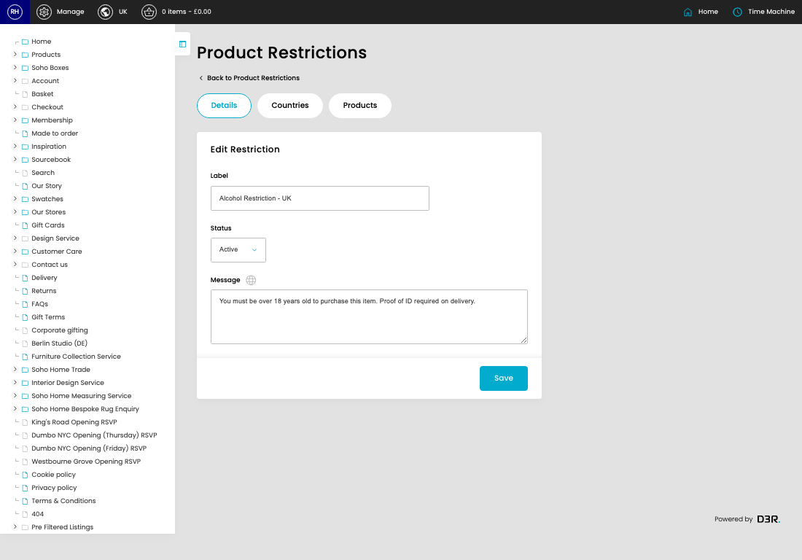
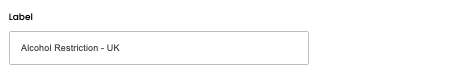
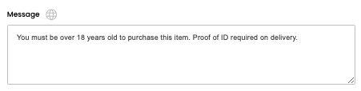

# Product Restrictions

[Home](../../index.md) / Edit Product Restriction

URL: [https://sohohome.com/cp/products-restrictions-admin/edit/1](https://sohohome.com/cp/products-restrictions-admin/edit/1)

Product Restrictions covers the admin screen used to review and maintain product restrictions.

*Product Restrictions page overview*

## Related Pages

- [Product Restrictions](../143-cp-products-restrictions-admin-9307ec8b/README.md): Review the visible fields to check what already exists.

## How It Works

- After this has been updated.
- Refresh Action.
- The key fields are Label, Status, Message, Restricted Countries, and UK Products, which explain what the record is for and how it can be used.

## Using This Page

1. Open the existing product restriction you need to change.
2. Work through the fields that are relevant to the change.
3. Save once the details are correct.

## What You Can Do

### Edit an existing product restriction

Open an existing product restriction when you need to check the setup or make a change.

- Save once the details are correct.

## Key Settings

### Edit Restriction

#### Label

*Label setting*

Add the label.

**Validation:** Required.

#### Status

*Status setting*

Choose the option that matches this status.

**Options:** Active, Inactive

#### Message

*Message setting*

Write the message content.

**Validation:** Required.

## Available Actions

- Details
- Countries
- Products
