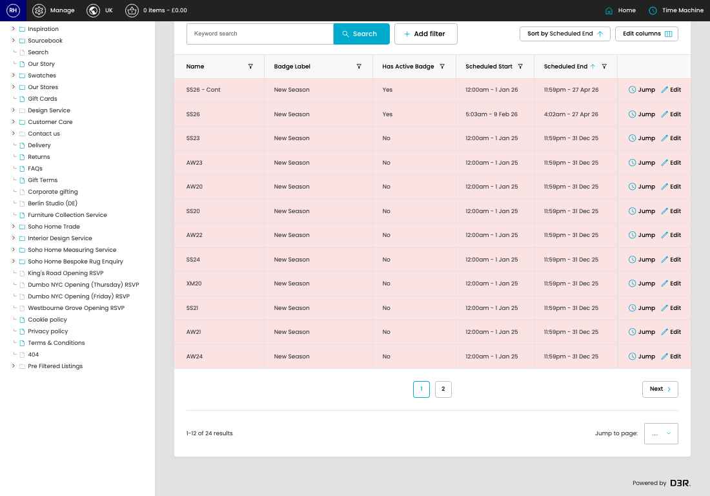

# Product Seasons

[Home](../../index.md) / Product Seasons

URL: [https://sohohome.com/cp/products-seasons-admin](https://sohohome.com/cp/products-seasons-admin)

Product Seasons covers the admin screen used to review and maintain product seasons.

*Product Seasons page overview*

## Related Pages

- [Edit Product Season](../146-cp-products-seasons-admin-edit-21-5fa80e1a/README.md): Open an existing product season when you need to check the setup or make a change.

## How It Works

- The key fields are Name, Badge Label, Badge CSS Class, Link URL, and Has Active Badge, which explain what the record is for and how it can be used.

## Using This Page

1. Open Product Seasons from the CP navigation.
2. Search or filter until you find the product season you need.

## What You Can Do

### Review product seasons

Search or filter the visible fields to find the product season you need.

- Field: Name
- Field: Badge Label
- Field: Has Active Badge
- Field: Scheduled Start
- Field: Scheduled End

Example rows:

| Name | Badge Label | Has Active Badge | Scheduled Start | Scheduled End |
| --- | --- | --- | --- | --- |
| SS26 - Cont | New Season | Yes | 12:00am - 1 Jan 26 | 11:59pm - 27 Apr 26 |
| SS26 | New Season | Yes | 5:03am - 9 Feb 26 | 4:02am - 27 Apr 26 |
| SS23 | New Season | No | 12:00am - 1 Jan 25 | 11:59pm - 31 Dec 25 |
