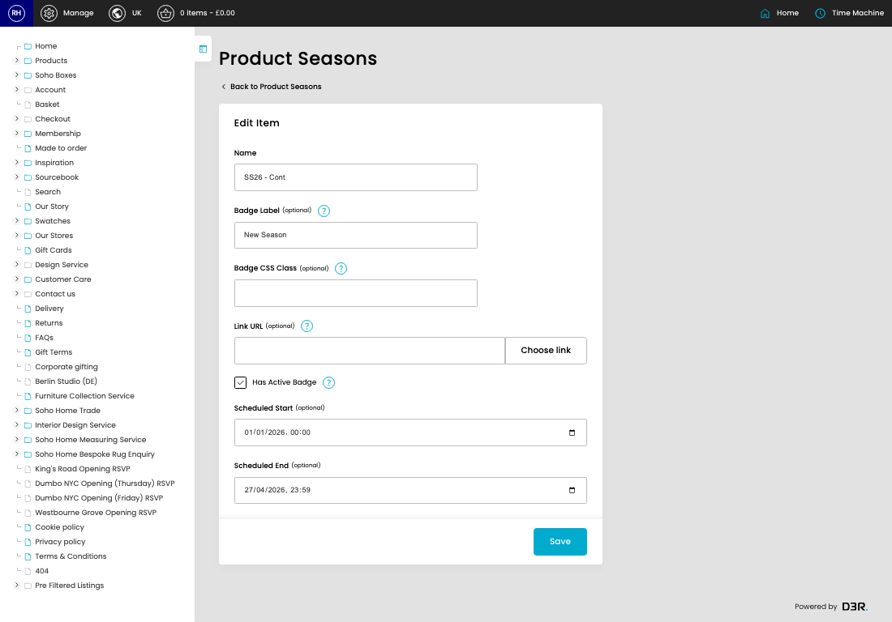
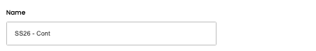
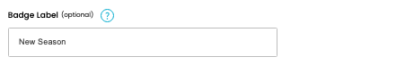
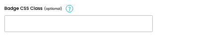
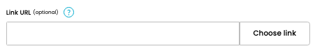
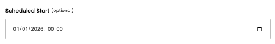
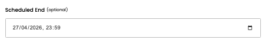

# Product Seasons

[Home](../../index.md) / [Product Seasons](../145-cp-products-seasons-admin-24b814ad/README.md) / Edit Product Season

URL: [https://sohohome.com/cp/products-seasons-admin/edit/:id](https://sohohome.com/cp/products-seasons-admin/edit/:id)

Season manages product seasons for "New In" badge scheduling

*Product Seasons page overview*

## Related Pages

- [Product Seasons](../145-cp-products-seasons-admin-24b814ad/README.md): Search or filter the visible fields to find the product season you need.

## How It Works

- The key fields are Name, Badge Label, Badge CSS Class, Link URL, and Has Active Badge, which explain what the record is for and how it can be used.

## Using This Page

1. Open the existing product season you need to change.
2. Work through the fields that are relevant to the change.
3. Save once the details are correct.

## What You Can Do

### Edit an existing product season

Open an existing product season when you need to check the setup or make a change.

- Save once the details are correct.

## Key Settings

### Edit Item

#### Name

*Name setting*

Add the name.

**Validation:** Required.

#### Badge Label (optional)

*Badge Label (optional) setting*

Add the badge label (optional).

**Notes:** Text displayed on the badge (e.g., "New Season", "AW25 Collection")

#### Badge CSS Class (optional)

*Badge CSS Class (optional) setting*

Add the badge CSS class (optional).

**Notes:** Optional CSS class override (e.g., "red" becomes product__badge--red)

#### Link URL (optional)

*Link URL (optional) setting*

Add the link URL (optional).

**Notes:** Optional URL to make badge clickable (e.g., /shop/new-season). Leave blank for non-clickable badge.

#### Has Active Badge

Turn this on when the answer should be yes. Leave it off when it should not apply.

**Notes:** Toggle to show/hide badge for this season (independent of schedule)

#### Scheduled Start (optional)

*Scheduled Start (optional) setting*

Add the scheduled start (optional).

**Notes:** optional

#### Scheduled End (optional)

*Scheduled End (optional) setting*

Add the scheduled end (optional).

**Notes:** optional

## Page Sections

- Choose link
