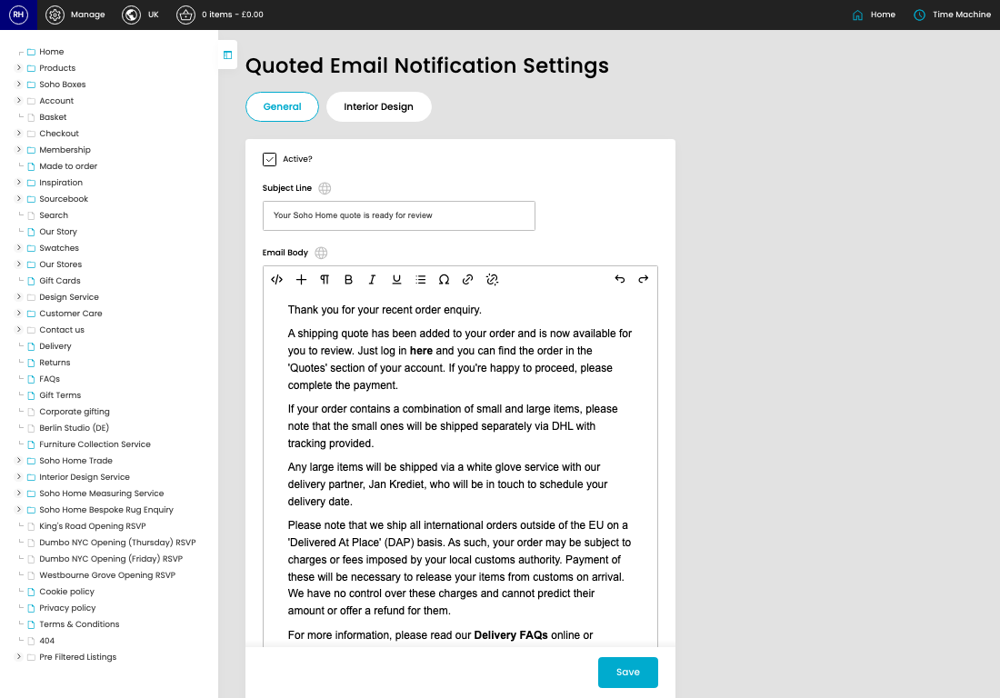
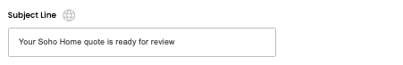

# Quoted Notification Email Settings

[Home](../../index.md) / Quoted Notification Email Settings

URL: [https://sohohome.com/cp/quoted-email-content-admin](https://sohohome.com/cp/quoted-email-content-admin)

Model for Quoted Email Notification Content

*Quoted Notification Email Settings page overview*

## How It Works

- The key fields are Active?, Subject Line, Email Body, Active?, and Subject Line, which explain what the record is for and how it can be used.

## Using This Page

1. Open the Quoted Notification Email Settings screen.
2. Work through the fields that are relevant to the change, then save once the details are correct.

## What You Can Do

### Update settings

Use the fields on this screen to make the change, then save once the values are correct.

## Key Settings

### Quoted Email Notification Settings

#### Active?

Turn this on when active? should apply. Leave it off when it should not.

#### Subject Line

*Subject Line setting*

Add the subject line.

**Validation:** Required.

#### Email Body

Write the email body content.

## Page Sections

- General
- Interior Design
