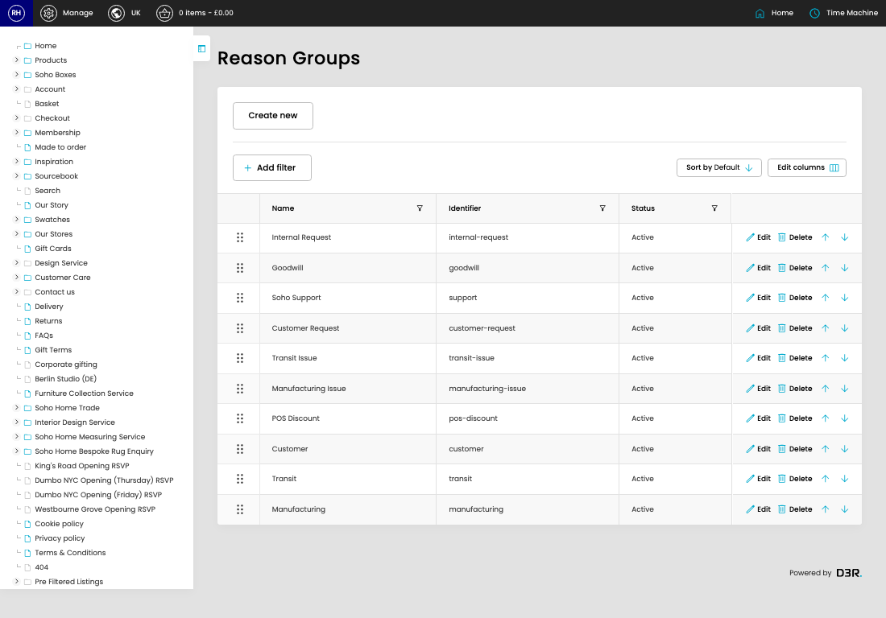

# Reason Groups

[Home](../../index.md) / Reason Groups

URL: [https://sohohome.com/cp/reason-groups-admin](https://sohohome.com/cp/reason-groups-admin)

Reason Groups covers the admin screen used to review and maintain reason groups.

*Reason Groups page overview*

## Related Pages

- [Edit Reason Group](../149-cp-reason-groups-admin-edit-1-cb4f1a10/README.md): Open an existing reason group when you need to check the setup or make a change.

## How It Works

- Makes sure the transfer property is set appropriately.
- The key fields are Name, Identifier, Position, Status, and Reasons, which explain what the record is for and how it can be used.

## Using This Page

1. Open Reason Groups from the CP navigation.
2. Scan the fields in the table to find the reason group you need.

## What You Can Do

### Review reason groups

Review the visible fields to check what already exists.

- Field: Name
- Field: Identifier
- Field: Status

Example rows:

| Name | Identifier | Status |
| --- | --- | --- |
|  | Internal Request | internal-request |
|  | Goodwill | goodwill |
|  | Soho Support | support |
