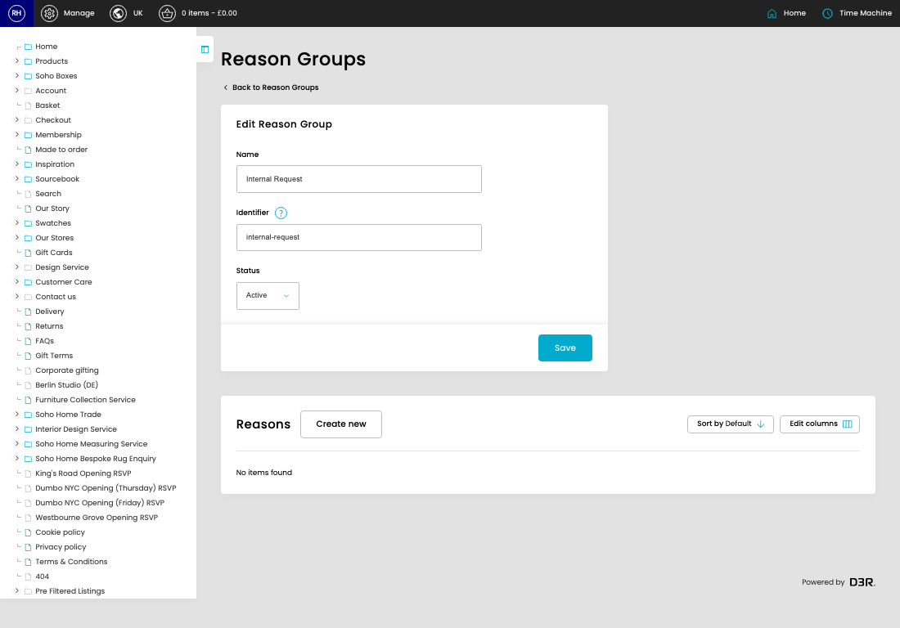
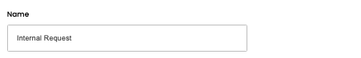
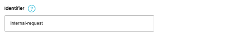

# Reason Groups

[Home](../../index.md) / Edit Reason Group

URL: [https://sohohome.com/cp/reason-groups-admin/edit/1](https://sohohome.com/cp/reason-groups-admin/edit/1)

Reason Groups covers the admin screen used to review and maintain reason groups.

*Reason Groups page overview*

## Related Pages

- [Reason Groups](../148-cp-reason-groups-admin-2d5ac2ad/README.md): Review the visible fields to check what already exists.

## How It Works

- Makes sure the transfer property is set appropriately.
- The key fields are Name, Identifier, Position, Status, and Reasons, which explain what the record is for and how it can be used.

## Using This Page

1. Open the existing reason group you need to change.
2. Work through the fields that are relevant to the change.
3. Save once the details are correct.

## What You Can Do

### Edit an existing reason group

Open an existing reason group when you need to check the setup or make a change.

- Save once the details are correct.

## Key Settings

### Edit Reason Group

#### Name

*Name setting*

Add the name.

**Validation:** Required.

#### Identifier

*Identifier setting*

Add the identifier.

**Validation:** Required.

**Notes:** Unique slug key (e.g. "internal-request")

#### Status

*Status setting*

Choose the option that matches this status.

**Options:** Active, Inactive
