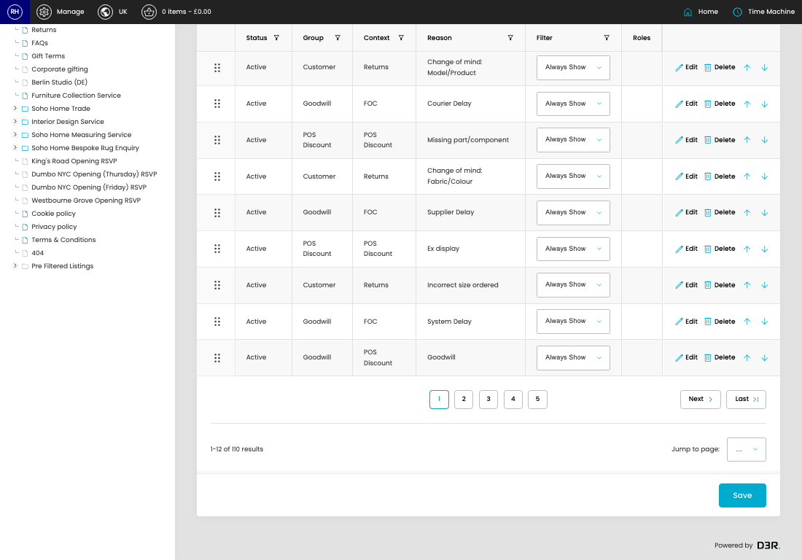

# Reasons

[Home](../../index.md) / Reasons

URL: [https://sohohome.com/cp/reasons-admin](https://sohohome.com/cp/reasons-admin)

Reasons lets admins find and review existing reasons.

*Reasons page overview*

## Related Pages

- [Edit Reason](../151-cp-reasons-admin-edit-id-d56b7f43/README.md): Open an existing reason when you need to check the setup or make a change.

## How It Works

- Makes sure the transfer property is set appropriately.
- The key fields are Status, Group, Context, Reason, and Filter, which explain what the record is for and how it can be used.

## Using This Page

1. Scan the fields in the table to find the reason you need.

## What You Can Do

### Review reasons

Review the visible fields to check what already exists.

- Visible fields include Status, Group, Context, Reason, Filter, and Roles.

Example rows:

| Status | Group | Context | Reason | Filter | Roles |
| --- | --- | --- | --- | --- | --- |
|  | Active | Customer | Returns | No longer wants to wait / LT too long | select… Always Show Pre Dispatch Post Dispatch |
|  | Active | Goodwill | FOC | Damaged in Transit | select… Always Show Pre Dispatch Post Dispatch |
|  | Active | POS Discount | POS Discount | Incorrectly priced | select… Always Show Pre Dispatch Post Dispatch |

### Update settings

Use the fields on this screen to make the change, then save once the values are correct.
