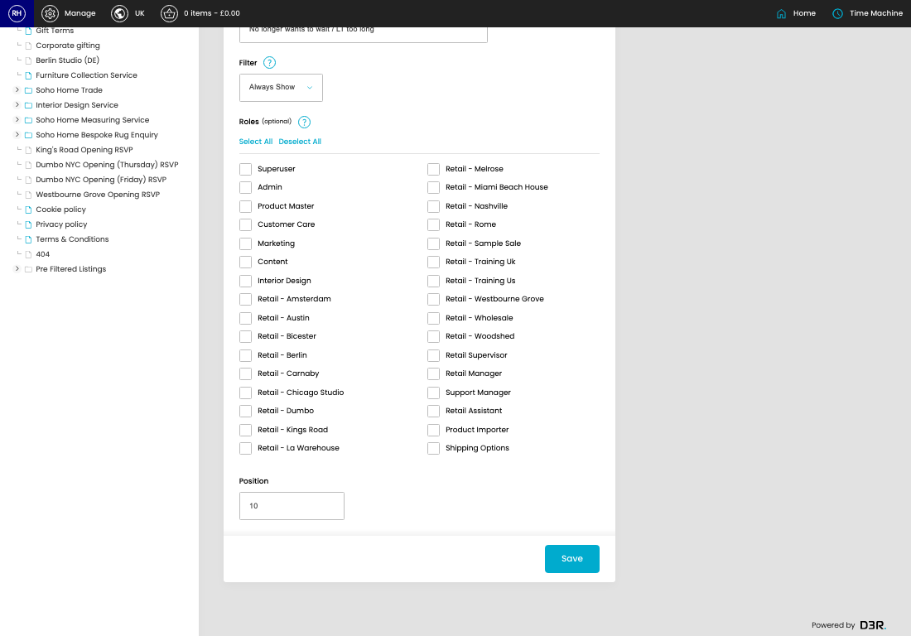
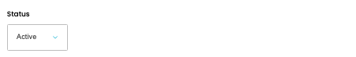
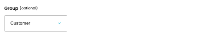
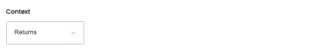
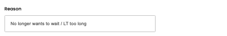
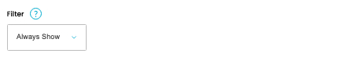

# Reasons

[Home](../../index.md) / Edit Reason

URL: [https://sohohome.com/cp/reasons-admin/edit/1](https://sohohome.com/cp/reasons-admin/edit/1)

Reasons covers the admin screen used to review and maintain reasons.

*Reasons page overview*

## Related Pages

- [Reasons](../150-cp-reasons-admin-97dbfa81/README.md): Review the visible fields to check what already exists.

## How It Works

- Makes sure the transfer property is set appropriately.
- The key fields are Status, Group, Context, Reason, and Filter, which explain what the record is for and how it can be used.

## Using This Page

1. Open the existing reason you need to change.
2. Work through the fields that are relevant to the change.
3. Save once the details are correct.

## What You Can Do

### Edit an existing reason

Open an existing reason when you need to check the setup or make a change.

- Save once the details are correct.

## Key Settings

The sections below highlight the settings people are most likely to change.

### Edit Reason

#### Status

*Status setting*

Choose the option that matches this status.

**Options:** Active, Inactive

#### Group (optional)

*Group (optional) setting*

Choose the option that matches this group (optional).

**Options:** Internal Request, Goodwill, Soho Support, Customer Request, Transit Issue, Manufacturing Issue, POS Discount, Customer, Transit, Manufacturing

**Notes:** optional

#### Context

*Context setting*

Choose the option that matches this context.

**Options:** FOC, Returns, Custom Discount, POS Discount

#### Reason

*Reason setting*

Add the reason.

**Validation:** Required.

#### Filter

*Filter setting*

Choose the option that matches this filter.

**Options:** Always Show, Pre Dispatch, Post Dispatch

**Notes:** When to show this reason (returns context only)

#### Superuser

*Superuser setting*

Turn this on when superuser should apply. Leave it off when it should not.

**Notes:** Select which roles can use this reason (leave empty for all roles)

#### Admin

*Admin setting*

Turn this on when admin should apply. Leave it off when it should not.

**Notes:** Select which roles can use this reason (leave empty for all roles)

#### Product Master

*Product Master setting*

Turn this on when product master should apply. Leave it off when it should not.

**Notes:** Select which roles can use this reason (leave empty for all roles)

#### Customer Care

Turn this on when customer care should apply. Leave it off when it should not.

**Notes:** Select which roles can use this reason (leave empty for all roles)

#### Marketing

Turn this on when marketing should apply. Leave it off when it should not.

**Notes:** Select which roles can use this reason (leave empty for all roles)

#### Content

Turn this on when content should apply. Leave it off when it should not.

**Notes:** Select which roles can use this reason (leave empty for all roles)

#### Interior Design

Turn this on when interior design should apply. Leave it off when it should not.

**Notes:** Select which roles can use this reason (leave empty for all roles)

#### Retail - Amsterdam

Turn this on when retail - amsterdam should apply. Leave it off when it should not.

**Notes:** Select which roles can use this reason (leave empty for all roles)

#### Retail - Austin

Turn this on when retail - austin should apply. Leave it off when it should not.

**Notes:** Select which roles can use this reason (leave empty for all roles)

#### Retail - Bicester

Turn this on when retail - bicester should apply. Leave it off when it should not.

**Notes:** Select which roles can use this reason (leave empty for all roles)

#### Retail - Berlin

Turn this on when retail - berlin should apply. Leave it off when it should not.

**Notes:** Select which roles can use this reason (leave empty for all roles)

#### Retail - Carnaby

Turn this on when retail - carnaby should apply. Leave it off when it should not.

**Notes:** Select which roles can use this reason (leave empty for all roles)

#### Retail - Chicago Studio

Turn this on when retail - chicago studio should apply. Leave it off when it should not.

**Notes:** Select which roles can use this reason (leave empty for all roles)

#### Retail - Dumbo

Turn this on when retail - dumbo should apply. Leave it off when it should not.

**Notes:** Select which roles can use this reason (leave empty for all roles)

#### Retail - Kings Road

Turn this on when retail - kings road should apply. Leave it off when it should not.

**Notes:** Select which roles can use this reason (leave empty for all roles)

#### Retail - La Warehouse

Turn this on when retail - la warehouse should apply. Leave it off when it should not.

**Notes:** Select which roles can use this reason (leave empty for all roles)

#### Retail - Melrose

Turn this on when retail - melrose should apply. Leave it off when it should not.

**Notes:** Select which roles can use this reason (leave empty for all roles)

#### Retail - Miami Beach House

Turn this on when retail - miami beach house should apply. Leave it off when it should not.

**Notes:** Select which roles can use this reason (leave empty for all roles)

#### Retail - Nashville

Turn this on when retail - nashville should apply. Leave it off when it should not.

**Notes:** Select which roles can use this reason (leave empty for all roles)
