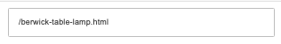
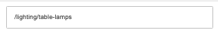
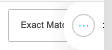
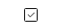

# Redirects

[Home](../../index.md) / Redirects

URL: [https://sohohome.com/cp/redirects](https://sohohome.com/cp/redirects)

Redirects covers the admin screen used to review and maintain redirects.

*Redirects page overview*

## Related Pages

- [Edit Redirect](../153-cp-redirects-edit-144-6dcf7cfc/README.md): Open an existing redirect when you need to check the setup or make a change.

## Using This Page

1. Open Redirects from the CP navigation.
2. Search or filter until you find the redirect you need.

## What You Can Do

### Review redirects

Search or filter the visible fields to find the redirect you need.

- Field: From
- Field: To
- Field: Type
- Field: Method
- Field: Strip params
- Field: Permanent

Example rows:

| From | To | Type | Method | Strip params | Permanent |
| --- | --- | --- | --- | --- | --- |
|  |  | Manual | select… Exact Match Head Match |  |  |
|  |  | Manual | select… Exact Match Head Match |  |  |
|  |  | Manual | select… Exact Match Head Match |  |  |

### Update settings

Use the fields on this screen to make the change, then save once the values are correct.

## Key Settings

The sections below highlight the settings people are most likely to change.

### listing-core_redirect-form

#### Redirect From

*Redirect From setting*

Set the Redirect From value for each relevant row in this section.

**Validation:** Required.

#### Redirect To

*Redirect To setting*

Set the Redirect To value for each relevant row in this section.

#### Redirect Method

*Redirect Method setting*

Set the Redirect Method value for each relevant row in this section.

**Options:** Exact Match, Head Match

#### Redirect Strip Params

*Redirect Strip Params setting*

Set the Redirect Strip Params value for each relevant row in this section.

#### Redirect Permanent

*Redirect Permanent setting*

Set the Redirect Permanent value for each relevant row in this section.

## Available Actions

- Import csv
