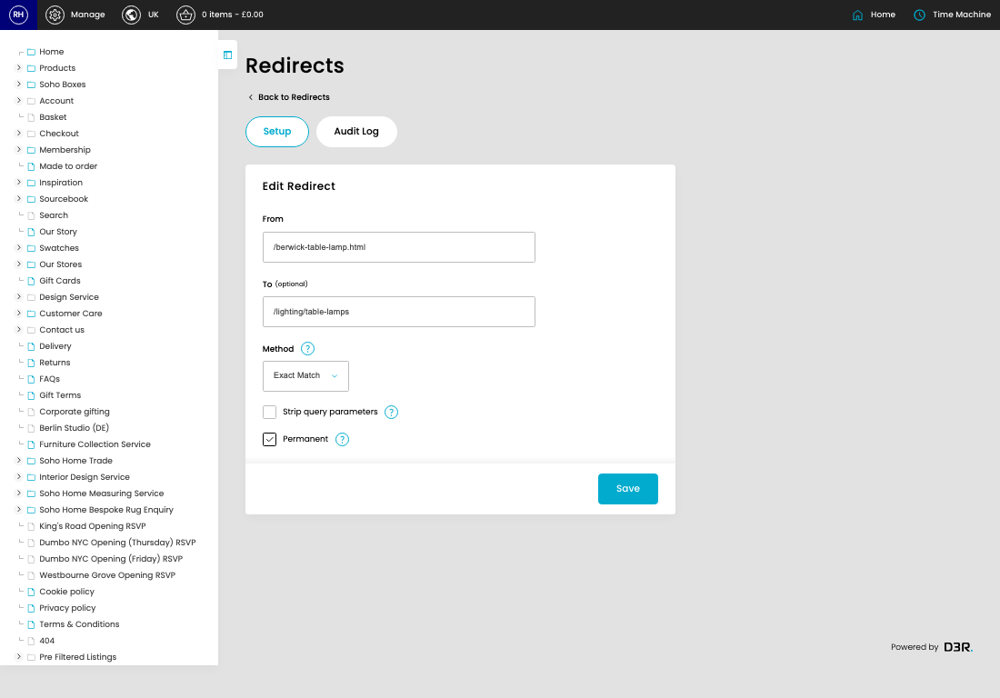
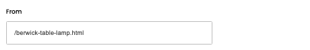
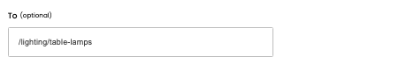
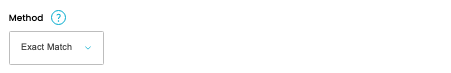

# Redirects

[Home](../../index.md) / [Redirects](../152-cp-redirects-7f08f116/README.md) / Edit Redirect

URL: [https://sohohome.com/cp/redirects/edit/:id](https://sohohome.com/cp/redirects/edit/:id)

Redirects manages URL redirects so old or changed links send visitors to the correct page.

*Redirects page overview*

## Related Pages

- [Redirects](../152-cp-redirects-7f08f116/README.md): Search or filter the visible fields to find the redirect you need.

## Using This Page

1. Open the existing redirect you need to change.
2. Work through the fields that are relevant to the change.
3. Save once the details are correct.

## What You Can Do

### Edit an existing redirect

Open an existing redirect when you need to check the setup or make a change.

- Save once the details are correct.

## Key Settings

### Edit Redirect

#### From

*From setting*

Add the from.

**Validation:** Required.

#### To (optional)

*To (optional) setting*

Add the to (optional).

**Notes:** optional

#### Method

*Method setting*

Choose the option that matches this method.

**Options:** Exact Match, Head Match

#### Strip query parameters

Turn this on when strip query parameters should apply. Leave it off when it should not.

#### Permanent

Turn this on when permanent should apply. Leave it off when it should not.

## Page Sections

- Setup
- Audit Log
