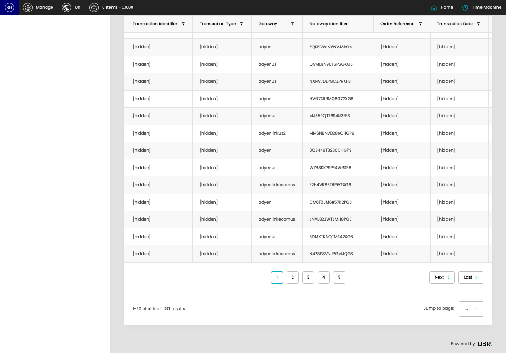

# Payments

[Home](../../index.md) / Payments

URL: [https://sohohome.com/cp/reporting_payments-admin](https://sohohome.com/cp/reporting_payments-admin)

Payments lets admins find and review existing payments.

*Payments page overview*

## Using This Page

1. Scan the fields in the table to find the payment you need.

## What You Can Do

### Review payments

Review the visible fields to check what already exists.

- Visible fields include Transaction Identifier, Transaction Type, Gateway, Gateway Identifier, Order Reference, Transaction Date, and Transaction Amount.
