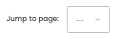

# Payments

[Home](../../index.md) / Payments

URL: [https://sohohome.com/cp/reporting_payments-admin](https://sohohome.com/cp/reporting_payments-admin)

Payments lets admins find and review existing payments.

*Payments page overview*

## Using This Page

1. Open Payments from the CP navigation.
2. Scan the fields in the table to find the payment you need.

## What You Can Do

### Review payments

Review the visible fields to check what already exists.

- Field: Transaction Identifier
- Field: Transaction Type
- Field: Gateway
- Field: Gateway Identifier
- Field: Order Reference
- Field: Transaction Date
- Field: Transaction Amount

Example rows:

| Transaction Identifier | Transaction Type | Gateway | Gateway Identifier | Order Reference | Transaction Date |
| --- | --- | --- | --- | --- | --- |
| S26062600521PP-00552838 | payment | adyenus | TMRKT5N2STJQGGR9 | S26062600521PP | 26/06/2026 00:55:30 |
| S26062600179IX-00182106 | payment | adyenus | K9ZJRKVMZ9QWWVW3 | S26062600179IX | 26/06/2026 00:18:22 |
| S2606260010CSG-00133316 | express | adyenterminalus | WWNQMQFBF9CWPZZ3 | S2606260010CSG | 26/06/2026 00:13:34 |

## Key Settings

The sections below highlight the settings people are most likely to change.

### Payments

#### select

*select setting*

Choose the option that matches this select.

**Options:** Load saved view, Refunds

## Available Actions

- Manage saved views
