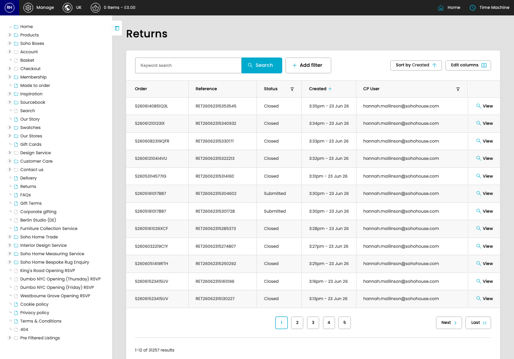

# Returns

[Home](../../index.md) / Returns

URL: [https://sohohome.com/cp/returns-admin](https://sohohome.com/cp/returns-admin)

Custom returns controller

*Returns page overview*

## Related Pages

- [View Return](../156-cp-returns-admin-view-36913-2bdad3f2/README.md): Review what already exists, then open a row when you need the full details.

## How It Works

- Makes sure the transfer property is set appropriately.
- The key fields are Return Queue and CP User, which explain what the record is for and how it can be used.

## Using This Page

1. Open Returns from the CP navigation.
2. Search or filter until you find the return you need.

## What You Can Do

### Review returns

Search or filter the visible fields to find the return you need.

- Field: Order
- Field: Reference
- Field: Status
- Field: Created
- Field: CP User

Example rows:

| Order | Reference | Status | Created | CP User |
| --- | --- | --- | --- | --- |
| S2606140851Q3L | RET26062315353545 | Closed | 3:35pm - 23 Jun 26 | hannah.mallinson@sohohouse.com |
| S26061210123IX | RET26062315340932 | Closed | 3:34pm - 23 Jun 26 | hannah.mallinson@sohohouse.com |
| S2606082319QFR | RET26062315330171 | Closed | 3:33pm - 23 Jun 26 | hannah.mallinson@sohohouse.com |
