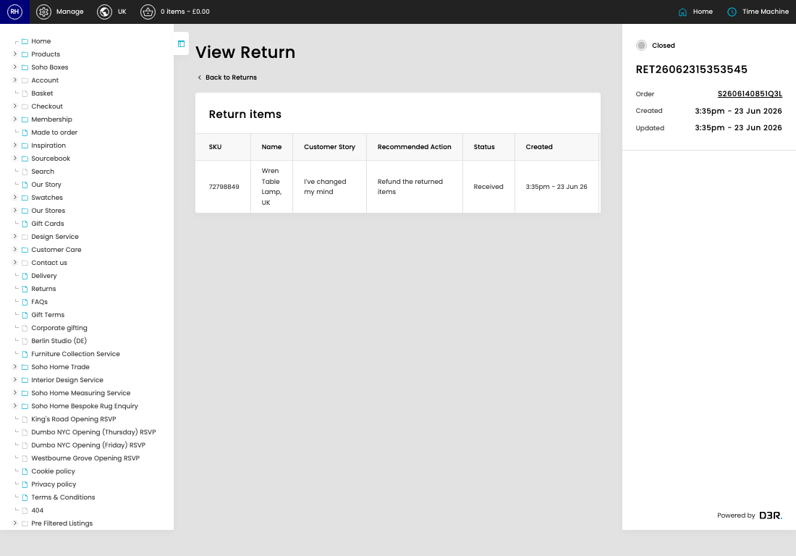

# Returns

[Home](../../index.md) / View Return

URL: [https://sohohome.com/cp/returns-admin/view/36913](https://sohohome.com/cp/returns-admin/view/36913)

Custom returns controller

*Returns page overview*

## Related Pages

- [Returns](../155-cp-returns-admin-799f6596/README.md): Search or filter the visible fields to find the return you need.

## How It Works

- Makes sure the transfer property is set appropriately.
- The key fields are Return Queue and CP User, which explain what the record is for and how it can be used.

## Using This Page

1. Open Returns from the CP navigation.
2. Scan the fields in the table to find the return you need.
3. Open a row when you need to check the full details.

## What You Can Do

### Review returns

Review what already exists, then open a row when you need the full details.

- Field: SKU
- Field: Name
- Field: Customer Story
- Field: Recommended Action
- Field: Status
- Field: Created
- Field: Reference
- Field: Inspection Reference
- Field: Reason (Tier 2)
- Field: Action Required
- Field: Inspection Decision
- Field: Date Completed

Example rows:

| SKU | Name | Customer Story | Recommended Action | Status | Created |
| --- | --- | --- | --- | --- | --- |
| 72798849 | Wren Table Lamp, UK | I’ve changed my mind | Refund the returned items | Received | 3:35pm - 23 Jun 26 |

### Review an existing return

Open an existing return when you need to check the full details.

Example rows:

| SKU | Name | Customer Story | Recommended Action | Status | Created |
| --- | --- | --- | --- | --- | --- |
| 72798849 | Wren Table Lamp, UK | I’ve changed my mind | Refund the returned items | Received | 3:35pm - 23 Jun 26 |
