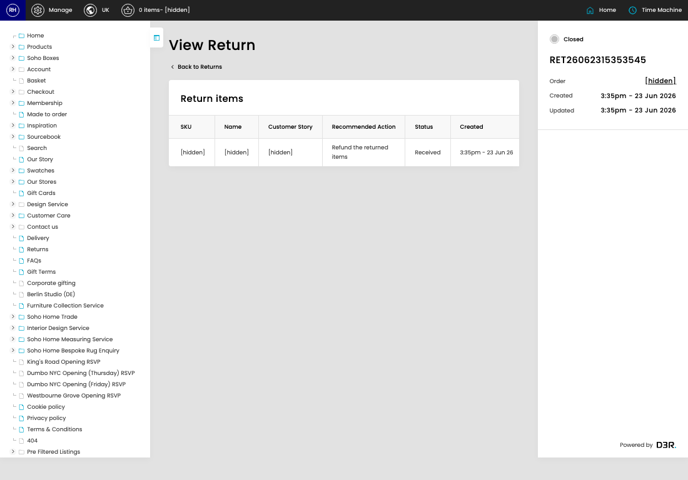

# Returns

[Home](../../index.md) / [Returns](../155-cp-returns-admin-799f6596/README.md) / View Return

URL: [https://sohohome.com/cp/returns-admin/view/:id](https://sohohome.com/cp/returns-admin/view/:id)

Returns is used to review return records and follow their processing status.

*Returns page overview*

## Related Pages

- [Returns](../155-cp-returns-admin-799f6596/README.md): Search or filter the visible fields to find the return you need.

## How It Works

- Makes sure the transfer property is set appropriately.
- The key fields are Return Queue and CP User, which explain what the record is for and how it can be used.

## Using This Page

1. Scan the fields in the table to find the return you need.
2. Open a row when you need to check the full details.

## What You Can Do

### Review returns

Review what already exists, then open a row when you need the full details.

- Visible fields include SKU, Name, Customer Story, Recommended Action, Status, Created, Reference, and Inspection Reference.

### Review an existing return

Open an existing return when you need to check the full details.
