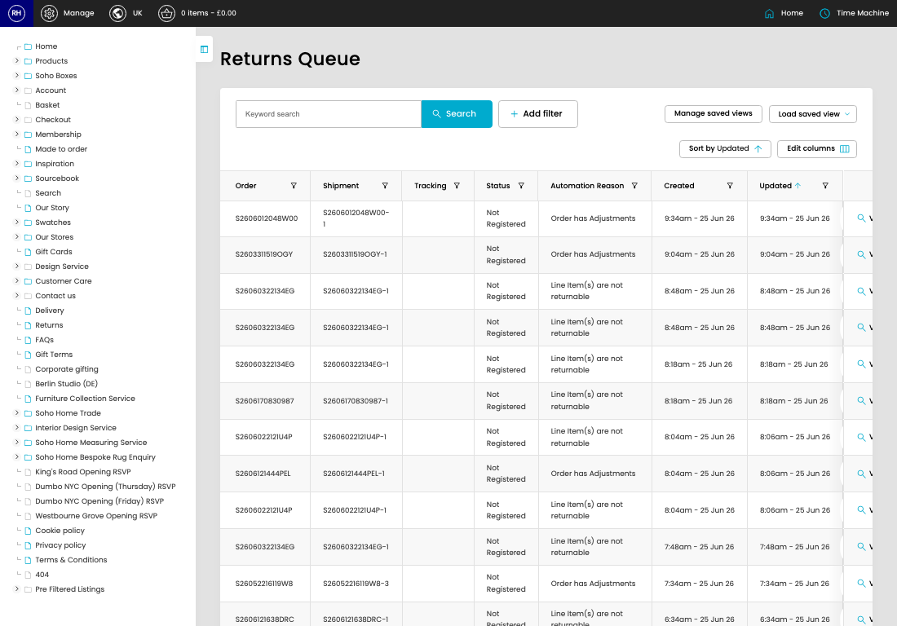

# Returns Queue

[Home](../../index.md) / Returns Queue

URL: [https://sohohome.com/cp/returns_queue-admin](https://sohohome.com/cp/returns_queue-admin)

Returns Queue controller

*Returns Queue page overview*

## Related Pages

- [View Returns Queue](../158-cp-returns-queue-admin-view-30479-6ea2ae48/README.md): Open an existing returns queue when you need to check the full details.

## How It Works

- Makes sure the transfer property is set appropriately.
- The key fields are Queue Item, Order, Shipment, Tracking, and Status, which explain what the record is for and how it can be used.

## Using This Page

1. Open Returns Queue from the CP navigation.
2. Search or filter until you find the returns queue you need.

## What You Can Do

### Review returns queue

Search or filter the visible fields to find the returns queue you need.

- Field: Order
- Field: Shipment
- Field: Tracking
- Field: Status
- Field: Automation Reason
- Field: Created
- Field: Updated

Example rows:

| Order | Shipment | Tracking | Status | Automation Reason | Created |
| --- | --- | --- | --- | --- | --- |
| S2606012048W00 | S2606012048W00-1 |  | Not Registered | Order has Adjustments | 9:34am - 25 Jun 26 |
| S2603311519OGY | S2603311519OGY-1 |  | Not Registered | Order has Adjustments | 9:04am - 25 Jun 26 |
| S26060322134EG | S26060322134EG-1 |  | Not Registered | Line Item(s) are not returnable | 8:48am - 25 Jun 26 |

## Key Settings

The sections below highlight the settings people are most likely to change.

### Returns Queue

#### select

*select setting*

Choose the option that matches this select.

**Options:** Load saved view, Open Returns

## Available Actions

- Manage saved views
