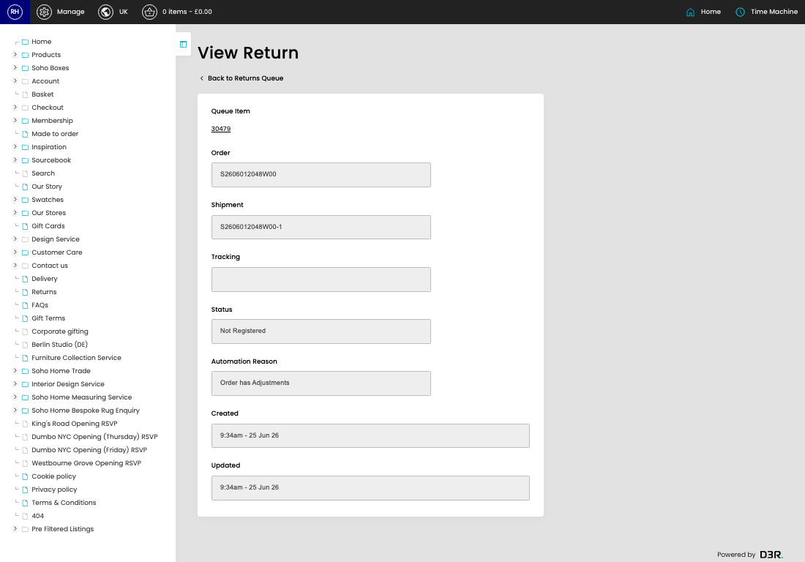

# Returns Queue

[Home](../../index.md) / View Returns Queue

URL: [https://sohohome.com/cp/returns_queue-admin/view/30479](https://sohohome.com/cp/returns_queue-admin/view/30479)

Returns Queue controller

*Returns Queue page overview*

## Related Pages

- [Returns Queue](../157-cp-returns-queue-admin-079753c9/README.md): Search or filter the visible fields to find the returns queue you need.

## How It Works

- Makes sure the transfer property is set appropriately.
- The key fields are Queue Item, Order, Shipment, Tracking, and Status, which explain what the record is for and how it can be used.

## Using This Page

1. Open the existing returns queue you need to review.
2. Use the visible fields to check the details.

## What You Can Do

### Review an existing returns queue

Open an existing returns queue when you need to check the full details.
