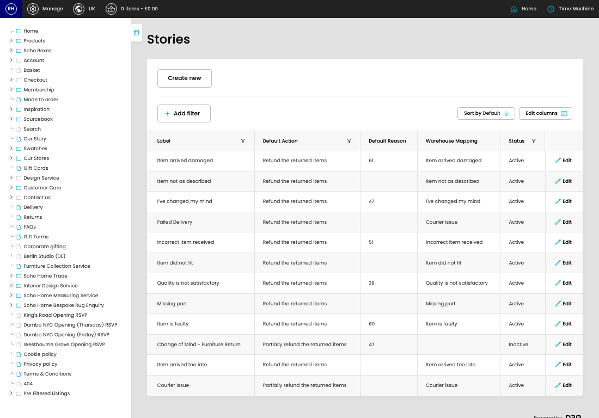

# Return Stories

[Home](../../index.md) / Return Stories

URL: [https://sohohome.com/cp/returns_stories-admin](https://sohohome.com/cp/returns_stories-admin)

Return Stories is used to review return records and follow their processing status.

*Return Stories page overview*

## Related Pages

- [Edit Return Story](../160-cp-returns-stories-admin-edit-id-9076842a/README.md): Open an existing return story when you need to check the setup or make a change.

## How It Works

- Makes sure the transfer property is set appropriately.
- The key fields are Default Reason, Warehouse Mapping, and Status, which explain what the record is for and how it can be used.

## Using This Page

1. Scan the fields in the table to find the return story you need.

## What You Can Do

### Review return stories

Review the visible fields to check what already exists.

- Visible fields include Label, Default Action, Default Reason, Warehouse Mapping, and Status.

Example rows:

| Label | Default Action | Default Reason | Warehouse Mapping | Status |
| --- | --- | --- | --- | --- |
| Item arrived damaged | Refund the returned items | 61 | Item arrived damaged | Active |
| Item not as described | Refund the returned items |  | Item not as described | Active |
| I’ve changed my mind | Refund the returned items | 47 | I've changed my mind | Active |
