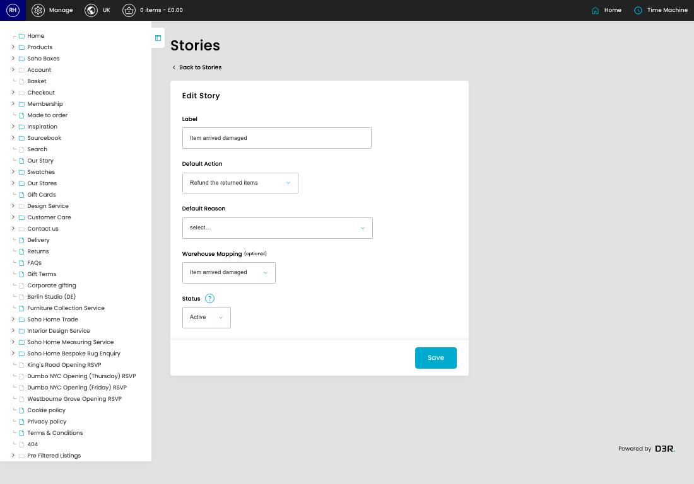
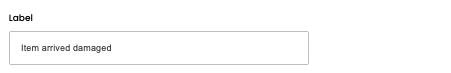
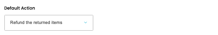
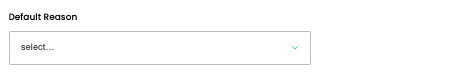
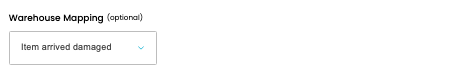
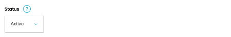

# Return Stories

[Home](../../index.md) / [Return Stories](../159-cp-returns-stories-admin-74ddf451/README.md) / Edit Return Story

URL: [https://sohohome.com/cp/returns_stories-admin/edit/:id](https://sohohome.com/cp/returns_stories-admin/edit/:id)

Return Stories is used to review return records and follow their processing status.

*Return Stories page overview*

## Related Pages

- [Return Stories](../159-cp-returns-stories-admin-74ddf451/README.md): Review the visible fields to check what already exists.

## How It Works

- Makes sure the transfer property is set appropriately.
- The key fields are Default Reason, Warehouse Mapping, and Status, which explain what the record is for and how it can be used.

## Using This Page

1. Open the existing return story you need to change.
2. Work through the fields that are relevant to the change.
3. Save once the details are correct.

## What You Can Do

### Edit an existing return story

Open an existing return story when you need to check the setup or make a change.

- Save once the details are correct.

## Key Settings

### Edit Story

#### Label

*Label setting*

Add the label.

**Validation:** Required.

#### Default Action

*Default Action setting*

Choose the option that matches this default action.

**Options:** Refund the returned items, Partially refund the returned items, Do not refund the returned items

#### Default Reason

*Default Reason setting*

Choose the option that matches this default reason.

**Options:** No longer wants to wait / LT too long, Change of mind: Model/Product, Change of mind: Fabric/Colour, Incorrect size ordered, Incorrect quantity ordered, Offer, Sale or Voucher not applied, Fraudulent Order, Shortage - Item cannot be located, Shortage - Item found to be damaged, Shipping Delay - still in Transit to Warehouse, Suez Canal Delays, Production Delay - still in Manufacturing at Factory, and 17 more

#### Warehouse Mapping (optional)

*Warehouse Mapping (optional) setting*

Choose the option that matches this warehouse mapping (optional).

**Options:** Quality is not satisfactory, Item arrived too late, Item not as described, I've changed my mind, Item arrived damaged, Incorrect item received, Item did not fit, Item is faulty, Missing part, Courier issue, Other

**Notes:** optional

#### Status

*Status setting*

Choose the option that matches this status.

**Options:** Active, Inactive

**Notes:** This currently only affects Return Automation Mapping selection
