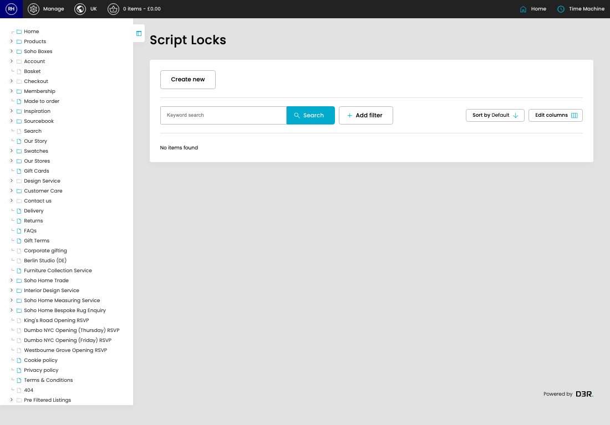

# Script Locks

[Home](../../index.md) / Script Locks

URL: [https://sohohome.com/cp/script-lock-admin](https://sohohome.com/cp/script-lock-admin)

Listing for Script Locks

*Script Locks page overview*

## Related Pages

- [Create Script Lock](../162-cp-script-lock-admin-edit-new-a40fe3fd/README.md): Use Create new when this script lock does not already exist. Complete the fields that describe it, then save.

## How It Works

- The key fields are Key and Owner, which explain what the record is for and how it can be used.

## Using This Page

1. Open the Script Locks screen.
2. Use the visible fields to check the details.
