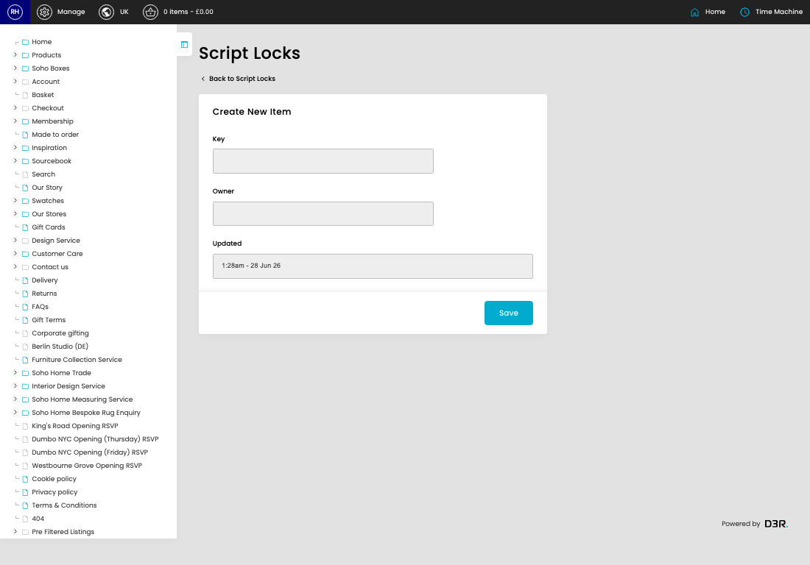

# Script Locks

[Home](../../index.md) / Create Script Lock

URL: [https://sohohome.com/cp/script-lock-admin/edit/new](https://sohohome.com/cp/script-lock-admin/edit/new)

Listing for Script Locks

*Script Locks page overview*

## Related Pages

- [Script Locks](../161-cp-script-lock-admin-2e4773a9/README.md): Listing for Script Locks

## How It Works

- The key fields are Key and Owner, which explain what the record is for and how it can be used.

## Using This Page

1. Create the new script lock from this screen.
2. Work through the fields that are relevant to the new record.
3. Save once the details are correct.

## What You Can Do

### Create a new script lock

Use Create new when this script lock does not already exist. Complete the fields that describe it, then save.

### Update settings

Use the fields on this screen to make the change, then save once the values are correct.
