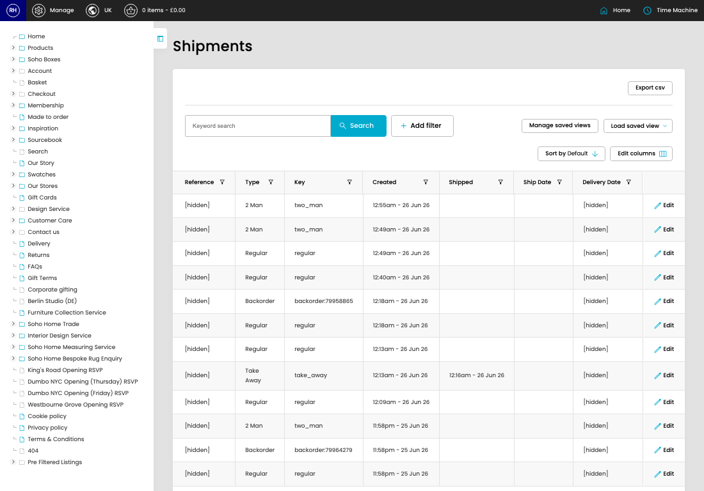

# Shipments

[Home](../../index.md) / Shipments

URL: [https://sohohome.com/cp/shipments-admin](https://sohohome.com/cp/shipments-admin)

Local bits.

*Shipments page overview*

## Related Pages

- [Edit Shipment](../164-cp-shipments-admin-edit-id-550ff726/README.md): Open an existing shipment when you need to check the setup or make a change.

## Using This Page

1. Search or filter until you find the shipment you need.

## What You Can Do

### Review shipments

Search or filter the visible fields to find the shipment you need.

- Visible fields include Reference, Type, Key, Created, Shipped, Ship Date, and Delivery Date.

Example rows:

| Reference | Type | Key | Created | Shipped | Ship Date |
| --- | --- | --- | --- | --- | --- |
| [hidden] | 2 Man | two_man | 12:55am - 26 Jun 26 |  |  |
| [hidden] | 2 Man | two_man | 12:49am - 26 Jun 26 |  |  |
| [hidden] | Regular | regular | 12:49am - 26 Jun 26 |  |  |
