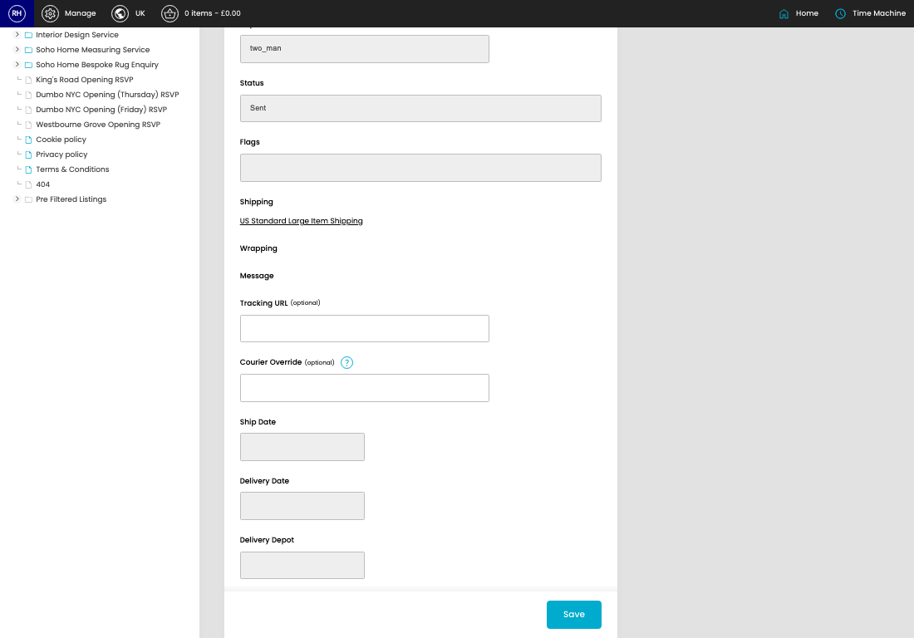

# Shipments

[Home](../../index.md) / Edit Shipment

URL: [https://sohohome.com/cp/shipments-admin/edit/612853](https://sohohome.com/cp/shipments-admin/edit/612853)

Local bits.

*Shipments page overview*

## Related Pages

- [Shipments](../163-cp-shipments-admin-1f0c092f/README.md): Search or filter the visible fields to find the shipment you need.

## Using This Page

1. Open the existing shipment you need to change.
2. Work through the fields that are relevant to the change.
3. Save once the details are correct.

## What You Can Do

### Edit an existing shipment

Open an existing shipment when you need to check the setup or make a change.

- Save once the details are correct.

## Key Settings

### Edit Shipment

#### Tracking URL (optional)

*Tracking URL (optional) setting*

Add the tracking URL (optional).

**Notes:** optional

#### Courier Override (optional)

*Courier Override (optional) setting*

Add the courier override (optional).

**Notes:** optional

## Available Actions

- Setup
- Items
- API Logs
- Audit Log
