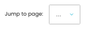

# Shipping Options

[Home](../../index.md) / Shipping Options

URL: [https://sohohome.com/cp/shipping-admin](https://sohohome.com/cp/shipping-admin)

App-level shipping option admin customisations.

*Shipping Options page overview*

## Related Pages

- [Edit Shipping Option](../166-cp-shipping-admin-edit-1-d086a580/README.md): Open an existing shipping option when you need to check the setup or make a change.

## How It Works

- The key fields are Min Tier, Max Tier, Min weight (kg), and Max weight (kg), which explain what the record is for and how it can be used.

## Using This Page

1. Open Shipping Options from the CP navigation.
2. Search or filter until you find the shipping option you need.

## What You Can Do

### Review shipping options

Search or filter the visible fields to find the shipping option you need.

- Field: Title
- Field: Display Title
- Field: Supplier (Dropship Only)
- Field: Status
- Field: Show in POS
- Field: Show in CP Shop
- Field: Allow Personalised Items
- Field: Service
- Field: Client
- Field: Offer Nominated Day
- Field: Consolidated Shipping
- Field: Experiment

Example rows:

| Title | Display Title | Supplier (Dropship Only) | Status | Show in POS | Show in CP Shop |
| --- | --- | --- | --- | --- | --- |
|  | Highlands/Ireland Standard Delivery - Tier 1 DHL | Standard Delivery |  | Active | Yes |
|  | UK Standard Delivery - Tiers 1-2 | UK Standard Delivery |  | Inactive | Yes |
|  | Highlands/Ireland Standard Delivery - Tier 2 DHL | Standard Delivery |  | Active | Yes |

## Key Settings

The sections below highlight the settings people are most likely to change.

### Shipping Options

#### select

*select setting*

Choose the option that matches this select.

**Options:** Load saved view, Active rules

## Available Actions

- Manage saved views
