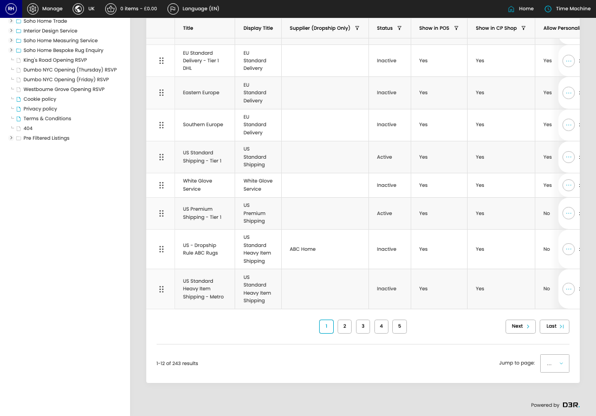

# Shipping Options

[Home](../../index.md) / Shipping Options

URL: [https://sohohome.com/cp/shipping-admin](https://sohohome.com/cp/shipping-admin)

App-level shipping option admin customisations.

*Shipping Options page overview*

## Related Pages

- [Edit Shipping Option](../166-cp-shipping-admin-edit-id-d086a580/README.md): Open an existing shipping option when you need to check the setup or make a change.

## How It Works

- The key fields are Min Tier, Max Tier, Min weight (kg), and Max weight (kg), which explain what the record is for and how it can be used.

## Using This Page

1. Search or filter until you find the shipping option you need.

## What You Can Do

### Review shipping options

Search or filter the visible fields to find the shipping option you need.

- Visible fields include Title, Display Title, Supplier (Dropship Only), Status, Show in POS, Show in CP Shop, Allow Personalised Items, and Service.

Example rows:

| Title | Display Title | Supplier (Dropship Only) | Status | Show in POS | Show in CP Shop |
| --- | --- | --- | --- | --- | --- |
|  | Highlands/Ireland Standard Delivery - Tier 1 DHL | Standard Delivery |  | Active | Yes |
|  | UK Standard Delivery - Tiers 1-2 | UK Standard Delivery |  | Inactive | Yes |
|  | Highlands/Ireland Standard Delivery - Tier 2 DHL | Standard Delivery |  | Active | Yes |
