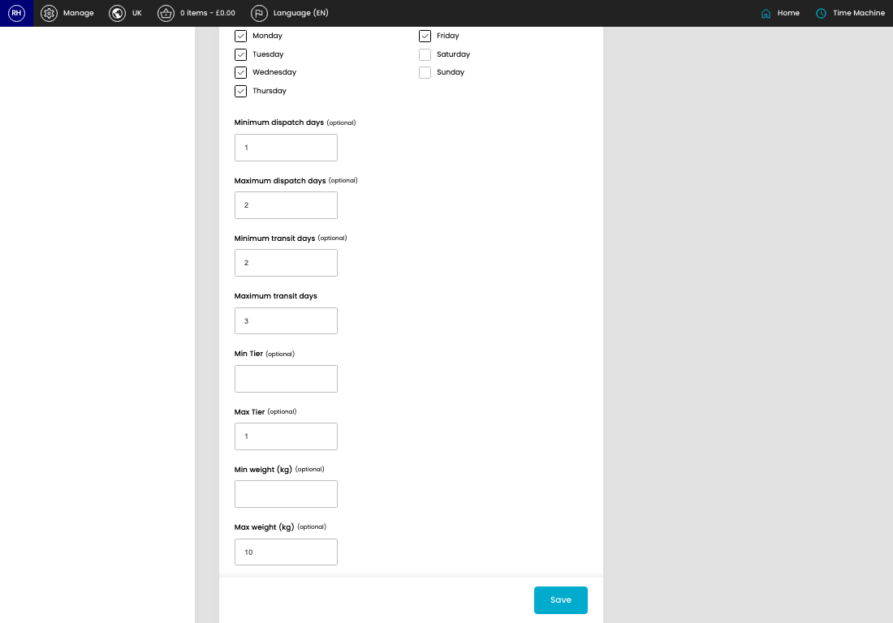
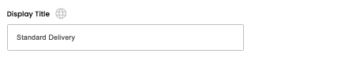
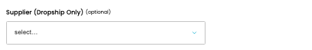
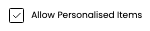

# Shipping Options

[Home](../../index.md) / Edit Shipping Option

URL: [https://sohohome.com/cp/shipping-admin/edit/1](https://sohohome.com/cp/shipping-admin/edit/1)

App-level shipping option admin customisations.

*Shipping Options page overview*

## Related Pages

- [Shipping Options](../165-cp-shipping-admin-1deed73f/README.md): Search or filter the visible fields to find the shipping option you need.

## How It Works

- The key fields are Min Tier, Max Tier, Min weight (kg), and Max weight (kg), which explain what the record is for and how it can be used.

## Using This Page

1. Open the existing shipping option you need to change.
2. Work through the fields that are relevant to the change.
3. Save once the details are correct.

## What You Can Do

### Edit an existing shipping option

Open an existing shipping option when you need to check the setup or make a change.

- Save once the details are correct.

## Key Settings

The sections below highlight the settings people are most likely to change.

### Edit Shipping Option

#### Title

*Title setting*

Add the title.

**Validation:** Required.

#### Display Title

*Display Title setting*

Add the display title.

**Validation:** Required.

#### Supplier (Dropship Only) (optional)

*Supplier (Dropship Only) (optional) setting*

Choose the option that matches this supplier (dropship only) (optional).

**Options:** 0, 12 NYC, ABC Home, Aboo, Abraham Moons, Acclaim, Acclaim Upholstery Co Ltd, ACV, ADB Furniture, Adrian, Aelia Towel, Aferfi, and 17 more

**Notes:** optional

#### Status

*Status setting*

Choose the option that matches this status.

**Options:** Active, Admin only, Inactive

#### Show in POS

*Show in POS setting*

Turn this on when the answer should be yes. Leave it off when it should not apply.

#### Show in CP Shop

*Show in CP Shop setting*

Turn this on when the answer should be yes. Leave it off when it should not apply.

#### Allow Personalised Items

*Allow Personalised Items setting*

Turn this on when allow personalised items should apply. Leave it off when it should not.

#### Service

*Service setting*

Choose the option that matches this service.

**Options:** Hermes Standard, Hermes Next Day, DPD Standard, DPD Next Day, DPD ExpressPak Next Day, DPD Pre-10, DPD Pre-12, DPD Saturday, DPD Saturday Pre-10, DPD Saturday Pre-12, DPD Sunday, DPD Sunday Pre-10, and 17 more

#### Client (optional)

Choose the option that matches this client (optional).

**Options:** Duo, Emailer, Wincanton

**Notes:** optional

#### Client Email (optional)

Add the client email (optional).

**Notes:** optional

#### Offer Nominated Day

Turn this on when offer nominated day should apply. Leave it off when it should not.

#### Take Away (No Stock)

Turn this on when take away (no stock) should apply. Leave it off when it should not.

#### Regular

Turn this on when regular should apply. Leave it off when it should not.

#### Backorder

Turn this on when backorder should apply. Leave it off when it should not.

#### 2 Man

Turn this on when 2 man should apply. Leave it off when it should not.

#### Assisted Lift

Turn this on when assisted lift should apply. Leave it off when it should not.

#### Swatch

Turn this on when swatch should apply. Leave it off when it should not.

#### 2 Man (Backorder)

Turn this on when 2 man (backorder) should apply. Leave it off when it should not.

#### Assisted Lift (Backorder)

Turn this on when assisted lift (backorder) should apply. Leave it off when it should not.

#### Dropship

Turn this on when dropship should apply. Leave it off when it should not.

#### Dropship MTO

Turn this on when dropship MTO should apply. Leave it off when it should not.

#### Paint

Turn this on when paint should apply. Leave it off when it should not.

#### Paint (Sample)

Turn this on when paint (sample) should apply. Leave it off when it should not.

#### Transfer

Turn this on when transfer should apply. Leave it off when it should not.

## Available Actions

- Setup
- Content
- Pricing
