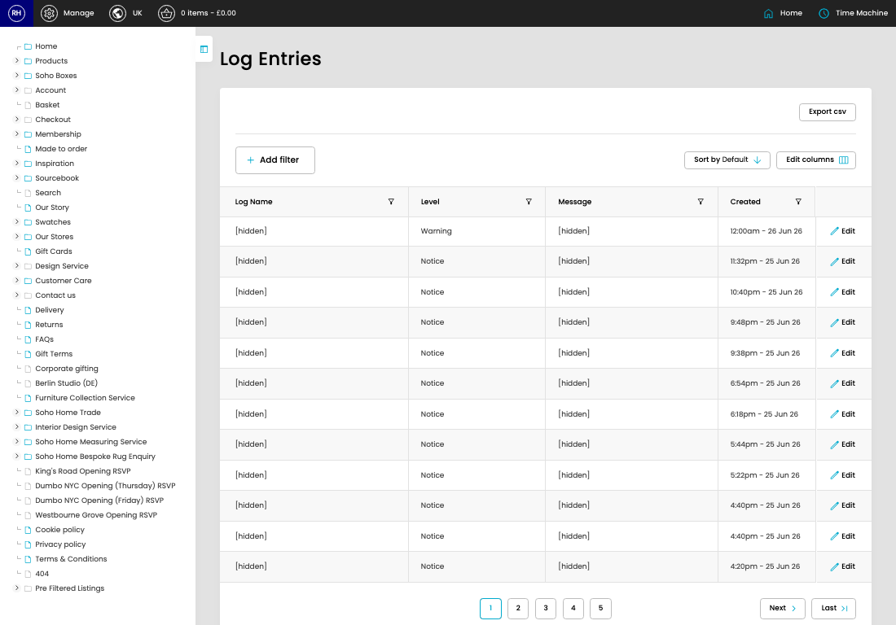

# Shipping Client Log

[Home](../../index.md) / Shipping Client Log

URL: [https://sohohome.com/cp/shipping-client-log-admin](https://sohohome.com/cp/shipping-client-log-admin)

Shipping Client Log Entry.

*Shipping Client Log page overview*

## Related Pages

- [Edit Shipping Client Log](../168-cp-shipping-client-log-admin-edit-id-02cd508f/README.md): Open an existing shipping client log when you need to check the setup or make a change.

## How It Works

- Makes sure the transfer property is set appropriately.

## Using This Page

1. Scan the fields in the table to find the shipping client log you need.

## What You Can Do

### Review shipping client log

Review the visible fields to check what already exists.

- Visible fields include Log Name, Level, Message, and Created.
