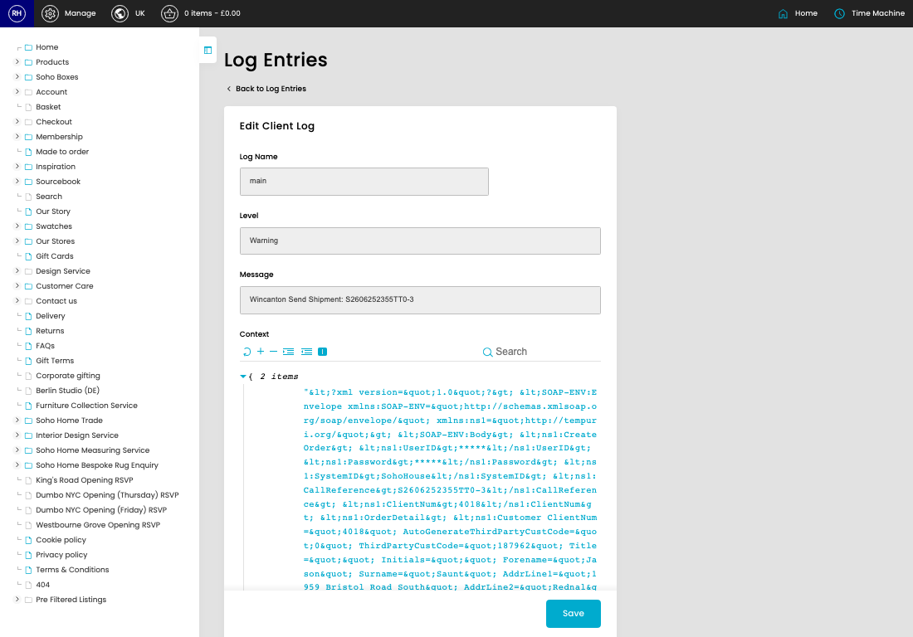

# Shipping Client Log

[Home](../../index.md) / Edit Shipping Client Log

URL: [https://sohohome.com/cp/shipping-client-log-admin/edit/29912](https://sohohome.com/cp/shipping-client-log-admin/edit/29912)

Shipping Client Log covers the admin screen used to review and maintain shipping client log.

*Shipping Client Log page overview*

## Related Pages

- [Shipping Client Log](../167-cp-shipping-client-log-admin-340c1a8c/README.md): Review the visible fields to check what already exists.

## How It Works

- Makes sure the transfer property is set appropriately.

## Using This Page

1. Open the existing shipping client log you need to change.
2. Work through the fields that are relevant to the change.
3. Save once the details are correct.

## What You Can Do

### Edit an existing shipping client log

Open an existing shipping client log when you need to check the setup or make a change.

- Save once the details are correct.
