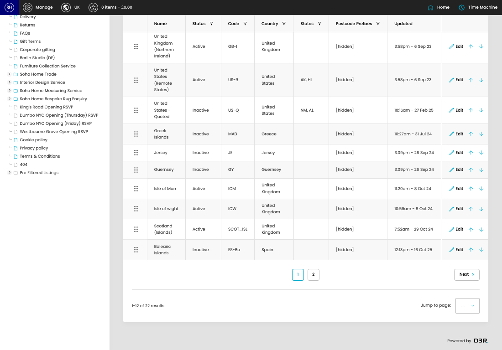

# Shipping Country Groups

[Home](../../index.md) / Shipping Country Groups

URL: [https://sohohome.com/cp/shipping-country-groups-admin](https://sohohome.com/cp/shipping-country-groups-admin)

Custom Country Group for shipping options.

*Shipping Country Groups page overview*

## Related Pages

- [Edit Shipping Country Group](../170-cp-shipping-country-groups-admin-edit-id-c123e654/README.md): Open an existing shipping country group when you need to check the setup or make a change.

## How It Works

- Makes sure the transfer property is set appropriately.
- The key fields are Name, Status, Code, Country, and States, which explain what the record is for and how it can be used.

## Using This Page

1. Search or filter until you find the shipping country group you need.

## What You Can Do

### Review shipping country groups

Search or filter the visible fields to find the shipping country group you need.

- Visible fields include Name, Status, Code, Country, States, Postcode Prefixes, and Updated.

Example rows:

| Name | Status | Code | Country | States | Postcode Prefixes |
| --- | --- | --- | --- | --- | --- |
|  | United Kingdom (Highlands) | Inactive | GB-H | United Kingdom |  |
|  | United Kingdom (Remote Areas) | Active | GB-R | United Kingdom |  |
|  | United Kingdom (Northern Ireland) | Active | GB-I | United Kingdom |  |
