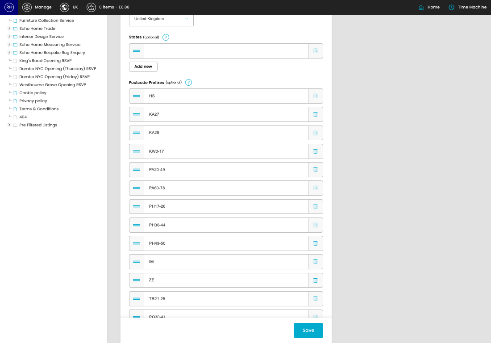
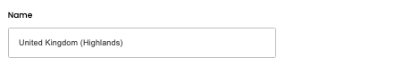
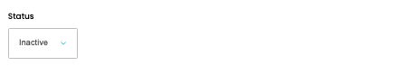
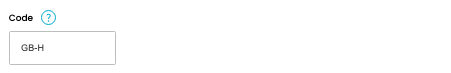
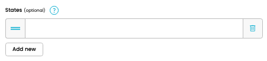
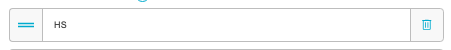
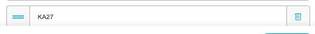

# Shipping Country Groups

[Home](../../index.md) / Edit Shipping Country Group

URL: [https://sohohome.com/cp/shipping-country-groups-admin/edit/1](https://sohohome.com/cp/shipping-country-groups-admin/edit/1)

Shipping Country Groups covers the admin screen used to review and maintain shipping country groups.

*Shipping Country Groups page overview*

## Related Pages

- [Shipping Country Groups](../169-cp-shipping-country-groups-admin-5b734fef/README.md): Search or filter the visible fields to find the shipping country group you need.

## How It Works

- Makes sure the transfer property is set appropriately.
- The key fields are Name, Status, Code, Country, and States, which explain what the record is for and how it can be used.

## Using This Page

1. Open the existing shipping country group you need to change.
2. Work through the fields that are relevant to the change.
3. Save once the details are correct.

## What You Can Do

### Edit an existing shipping country group

Open an existing shipping country group when you need to check the setup or make a change.

- Save once the details are correct.

## Key Settings

### Edit Shipping Country Group

#### Name

*Name setting*

Add the name.

**Validation:** Required.

#### Status

*Status setting*

Choose the option that matches this status.

**Options:** Active, Inactive

#### Code

*Code setting*

Add the code.

**Validation:** Required.

**Notes:** This should be formatted like [country code]-[variation] such as GB-I

#### Country

*Country setting*

Choose the option that matches this country.

**Options:** United Kingdom, United States, Australia, Austria, Belgium, Bosnia and Herzegovina, Canada, Croatia, Cyprus, Czech Republic, Denmark, Finland, and 17 more

#### group_states[0][]

*group_states[0][] setting*

Add the group_states[0][].

#### group_postcode_prefixes[0][]

*group_postcode_prefixes[0][] setting*

Add the group_postcode_prefixes[0][].

#### group_postcode_prefixes[1][]

*group_postcode_prefixes[1][] setting*

Add the group_postcode_prefixes[1][].

#### group_postcode_prefixes[2][]

*group_postcode_prefixes[2][] setting*

Add the group_postcode_prefixes[2][].

#### group_postcode_prefixes[3][]

Add the group_postcode_prefixes[3][].

#### group_postcode_prefixes[4][]

Add the group_postcode_prefixes[4][].

#### group_postcode_prefixes[5][]

Add the group_postcode_prefixes[5][].

#### group_postcode_prefixes[6][]

Add the group_postcode_prefixes[6][].

#### group_postcode_prefixes[7][]

Add the group_postcode_prefixes[7][].

#### group_postcode_prefixes[8][]

Add the group_postcode_prefixes[8][].

#### group_postcode_prefixes[9][]

Add the group_postcode_prefixes[9][].

#### group_postcode_prefixes[10][]

Add the group_postcode_prefixes[10][].

#### group_postcode_prefixes[11][]

Add the group_postcode_prefixes[11][].

#### group_postcode_prefixes[12][]

Add the group_postcode_prefixes[12][].

#### group_postcode_prefixes[13][]

Add the group_postcode_prefixes[13][].

## Available Actions

- Setup
- Audit Log
- Add new
