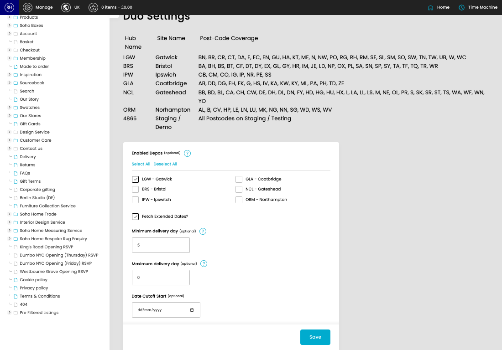

# Duo Settings

[Home](../../index.md) / Duo Settings

URL: [https://sohohome.com/cp/shipping-duo-settings-admin](https://sohohome.com/cp/shipping-duo-settings-admin)

Duo Settings covers the admin screen used to review and maintain duo settings.

*Duo Settings page overview*

## How It Works

- Makes sure the transfer property is set appropriately.
- The key fields are Enabled Depos, Fetch Extended Dates?, Minimum delivery day, Maximum delivery day, and Date Cutoff Start, which explain what the record is for and how it can be used.

## Using This Page

1. Open Duo Settings from the CP navigation.
2. Scan the fields in the table to find the duo setting you need.

## What You Can Do

### Review duo settings

Review the visible fields to check what already exists.

- Field: Hub Name
- Field: Site Name
- Field: Post-Code Coverage

Example rows:

| Hub Name | Site Name | Post-Code Coverage |
| --- | --- | --- |
| LGW | Gatwick | BN, BR, CR, CT, DA, E, EC, EN, GU, HA, KT, ME, N, NW, PO, RG, RH, RM, SE, SL, SM, SO, SW,  |
| BRS | Bristol | BA, BH, BS, BT, CF, DT, DY, EX, GL, GY, HR, IM, JE, LD, NP, OX, PL, SA, SN, SP, SY, TA, TF |
| IPW | Ipswich | CB, CM, CO, IG, IP, NR, PE, SS |

### Update settings

Use the fields on this screen to make the change, then save once the values are correct.

## Key Settings

### Duo Settings

#### LGW - Gatwick

*LGW - Gatwick setting*

Turn this on when LGW - gatwick should apply. Leave it off when it should not.

**Notes:** Allow dates from these depos

#### BRS - Bristol

*BRS - Bristol setting*

Turn this on when BRS - bristol should apply. Leave it off when it should not.

**Notes:** Allow dates from these depos

#### IPW - Ipswitch

*IPW - Ipswitch setting*

Turn this on when IPW - ipswitch should apply. Leave it off when it should not.

**Notes:** Allow dates from these depos

#### GLA - Coatbridge

*GLA - Coatbridge setting*

Turn this on when GLA - coatbridge should apply. Leave it off when it should not.

**Notes:** Allow dates from these depos

#### NCL - Gateshead

*NCL - Gateshead setting*

Turn this on when NCL - gateshead should apply. Leave it off when it should not.

**Notes:** Allow dates from these depos

#### ORM - Northampton

*ORM - Northampton setting*

Turn this on when ORM - northampton should apply. Leave it off when it should not.

**Notes:** Allow dates from these depos

#### Fetch Extended Dates?

*Fetch Extended Dates? setting*

Turn this on when fetch extended dates? should apply. Leave it off when it should not.

#### Minimum delivery day (optional)

*Minimum delivery day (optional) setting*

Add the minimum delivery day (optional).

**Notes:** Minimum days from time of order, 0 to disable

#### Maximum delivery day (optional)

Add the maximum delivery day (optional).

**Notes:** Maximum days from time of order, 0 to disable

#### Date Cutoff Start (optional)

Add the date cutoff start (optional).

**Notes:** optional

#### Date Cutoff End (optional)

Add the date cutoff end (optional).

**Notes:** optional
