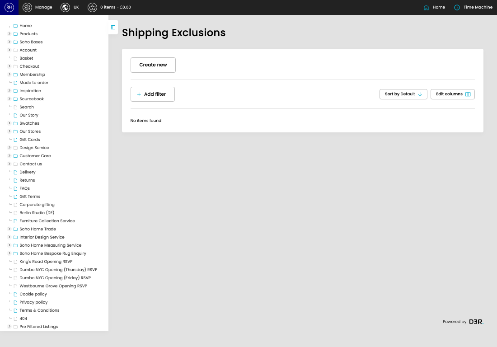

# Shipping Exclusions

[Home](../../index.md) / Shipping Exclusions

URL: [https://sohohome.com/cp/shipping-exclusions-admin](https://sohohome.com/cp/shipping-exclusions-admin)

Dates that don't count as working days

*Shipping Exclusions page overview*

## Related Pages

- [Create Shipping Exclusion](../173-cp-shipping-exclusions-admin-edit-new-ca241096/README.md): Use Create new when this shipping exclusion does not already exist. Complete the fields that describe it, then save.

## How It Works

- Makes sure the transfer property is set appropriately.
- The key fields are Title, Start Date, and End Date, which explain what the record is for and how it can be used.

## Using This Page

1. Open the Shipping Exclusions screen.
2. Use the visible fields to check the details.
