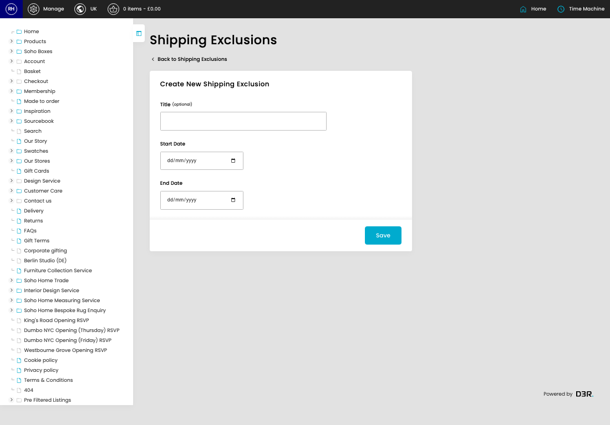
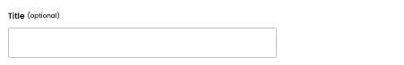
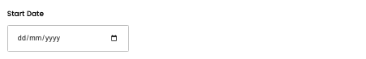
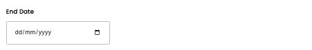

# Shipping Exclusions

[Home](../../index.md) / [Shipping Exclusions](../172-cp-shipping-exclusions-admin-e4ddfa2f/README.md) / Create Shipping Exclusion

URL: [https://sohohome.com/cp/shipping-exclusions-admin/edit/new](https://sohohome.com/cp/shipping-exclusions-admin/edit/new)

Dates that don't count as working days

*Shipping Exclusions page overview*

## Related Pages

- [Shipping Exclusions](../172-cp-shipping-exclusions-admin-e4ddfa2f/README.md): Dates that don't count as working days

## How It Works

- Makes sure the transfer property is set appropriately.
- The key fields are Title, Start Date, and End Date, which explain what the record is for and how it can be used.

## Using This Page

1. Create the new shipping exclusion from this screen.
2. Work through the fields that are relevant to the new record.
3. Save once the details are correct.

## What You Can Do

### Create a new shipping exclusion

Use Create new when this shipping exclusion does not already exist. Complete the fields that describe it, then save.

### Update settings

Use the fields on this screen to make the change, then save once the values are correct.

## Key Settings

### Create New Shipping Exclusion

#### Title (optional)

*Title (optional) setting*

Add the title (optional).

**Notes:** optional

#### Start Date

*Start Date setting*

Add the start date.

#### End Date

*End Date setting*

Add the end date.
