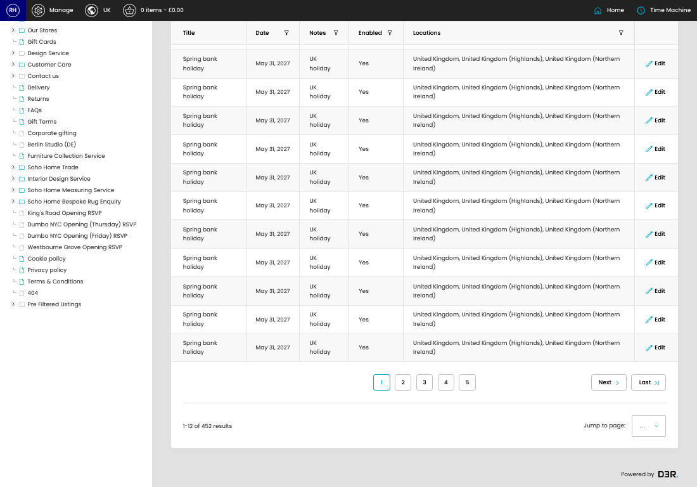

# Shipping Holidays

[Home](../../index.md) / Shipping Holidays

URL: [https://sohohome.com/cp/shipping-holidays-admin](https://sohohome.com/cp/shipping-holidays-admin)

Holidays for shipping exclusions

*Shipping Holidays page overview*

## Related Pages

- [Edit Shipping Holiday](../175-cp-shipping-holidays-admin-edit-id-bc22f9a9/README.md): Open an existing shipping holiday when you need to check the setup or make a change.

## How It Works

- Makes sure the transfer property is set appropriately.
- The key fields are Title, Date, Notes, Enabled, and Locations, which explain what the record is for and how it can be used.

## Using This Page

1. Scan the fields in the table to find the shipping holiday you need.

## What You Can Do

### Review shipping holidays

Review the visible fields to check what already exists.

- Visible fields include Title, Date, Notes, Enabled, and Locations.

Example rows:

| Title | Date | Notes | Enabled | Locations |
| --- | --- | --- | --- | --- |
| Spring bank holiday | May 31, 2027 | UK holiday | Yes | United Kingdom, United Kingdom (Highlands), United Kingdom (Northern Ireland) |
| Spring bank holiday | May 31, 2027 | UK holiday | Yes | United Kingdom, United Kingdom (Highlands), United Kingdom (Northern Ireland) |
| Spring bank holiday | May 31, 2027 | UK holiday | Yes | United Kingdom, United Kingdom (Highlands), United Kingdom (Northern Ireland) |
