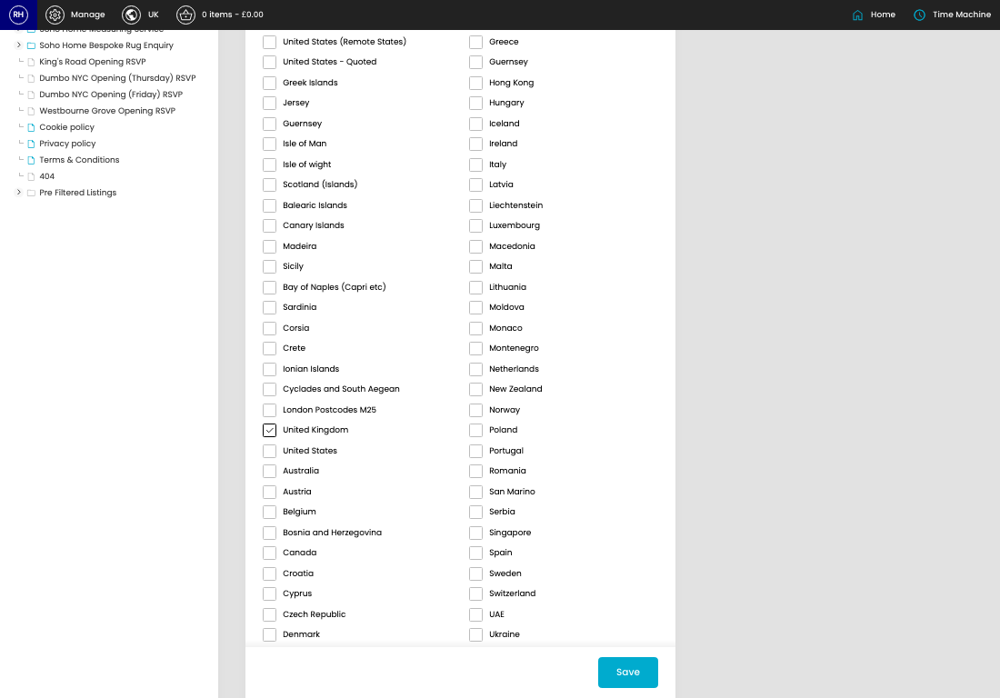
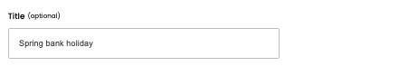
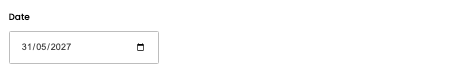
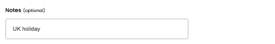
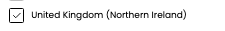

# Shipping Holidays

[Home](../../index.md) / Edit Shipping Holiday

URL: [https://sohohome.com/cp/shipping-holidays-admin/edit/404](https://sohohome.com/cp/shipping-holidays-admin/edit/404)

Shipping Holidays covers the admin screen used to review and maintain shipping holidays.

*Shipping Holidays page overview*

## Related Pages

- [Shipping Holidays](../174-cp-shipping-holidays-admin-3ac5b84f/README.md): Review the visible fields to check what already exists.

## How It Works

- Makes sure the transfer property is set appropriately.
- The key fields are Title, Date, Notes, Enabled, and Locations, which explain what the record is for and how it can be used.

## Using This Page

1. Open the existing shipping holiday you need to change.
2. Work through the fields that are relevant to the change.
3. Save once the details are correct.

## What You Can Do

### Edit an existing shipping holiday

Open an existing shipping holiday when you need to check the setup or make a change.

- Save once the details are correct.

## Key Settings

The sections below highlight the settings people are most likely to change.

### Edit Shipping Holiday

#### Title (optional)

*Title (optional) setting*

Add the title (optional).

**Notes:** optional

#### Date

*Date setting*

Add the date.

#### Notes (optional)

*Notes (optional) setting*

Add the notes (optional).

**Notes:** optional

#### Enabled

*Enabled setting*

Turn this on when enabled should apply. Leave it off when it should not.

#### United Kingdom (Highlands)

*United Kingdom (Highlands) setting*

Turn this on when united kingdom (highlands) should apply. Leave it off when it should not.

#### United Kingdom (Remote Areas)

*United Kingdom (Remote Areas) setting*

Turn this on when united kingdom (remote areas) should apply. Leave it off when it should not.

#### United Kingdom (Northern Ireland)

*United Kingdom (Northern Ireland) setting*

Turn this on when united kingdom (northern ireland) should apply. Leave it off when it should not.

#### United States (Remote States)

*United States (Remote States) setting*

Turn this on when united states (remote states) should apply. Leave it off when it should not.

#### United States - Quoted

Turn this on when united states - quoted should apply. Leave it off when it should not.

#### Greek Islands

Turn this on when greek islands should apply. Leave it off when it should not.

#### Jersey

Turn this on when jersey should apply. Leave it off when it should not.

#### Guernsey

Turn this on when guernsey should apply. Leave it off when it should not.

#### Isle of Man

Turn this on when isle of man should apply. Leave it off when it should not.

#### Isle of wight

Turn this on when isle of wight should apply. Leave it off when it should not.

#### Scotland (Islands)

Turn this on when scotland (islands) should apply. Leave it off when it should not.

#### Balearic Islands

Turn this on when balearic islands should apply. Leave it off when it should not.

#### Canary Islands

Turn this on when canary islands should apply. Leave it off when it should not.

#### Madeira

Turn this on when madeira should apply. Leave it off when it should not.

#### Sicily

Turn this on when sicily should apply. Leave it off when it should not.

#### Bay of Naples (Capri etc)

Turn this on when bay of naples (capri etc) should apply. Leave it off when it should not.

#### Sardinia

Turn this on when sardinia should apply. Leave it off when it should not.

#### Corsia

Turn this on when corsia should apply. Leave it off when it should not.

#### Crete

Turn this on when crete should apply. Leave it off when it should not.

#### Ionian Islands

Turn this on when ionian islands should apply. Leave it off when it should not.
