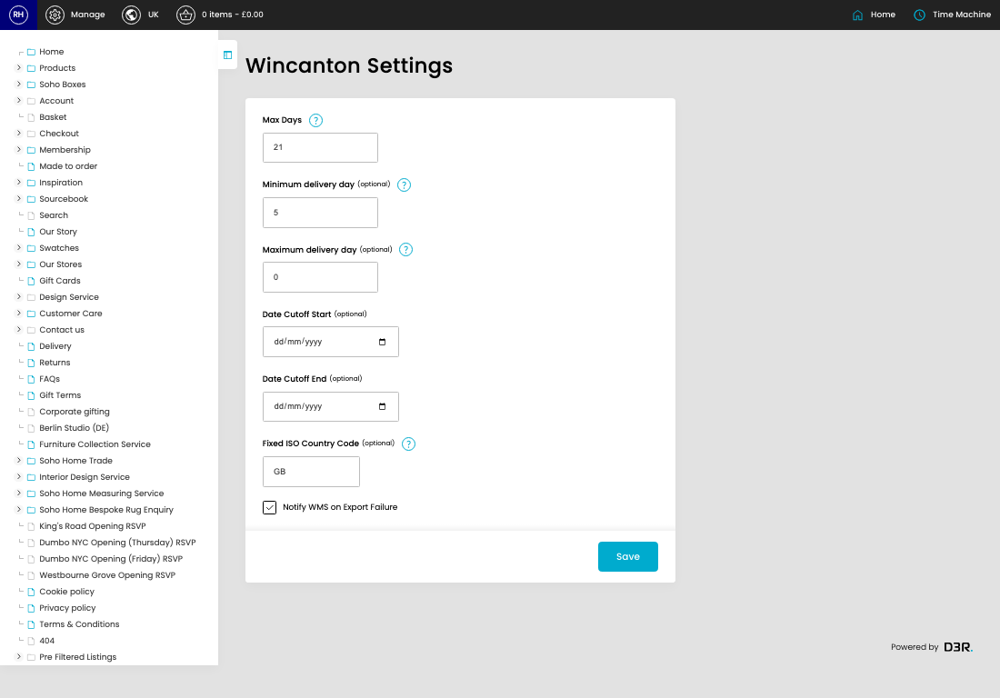
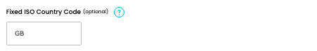

# Wincanton Settings

[Home](../../index.md) / Wincanton Settings

URL: [https://sohohome.com/cp/shipping-wincanton-settings-admin](https://sohohome.com/cp/shipping-wincanton-settings-admin)

Wincanton Settings covers the admin screen used to review and maintain wincanton settings.

*Wincanton Settings page overview*

## How It Works

- Makes sure the transfer property is set appropriately.
- The key fields are Max Days, Minimum delivery day, Maximum delivery day, Date Cutoff Start, and Date Cutoff End, which explain what the record is for and how it can be used.

## Using This Page

1. Open the Wincanton Settings screen.
2. Work through the fields that are relevant to the change, then save once the details are correct.

## What You Can Do

### Update settings

Use the fields on this screen to make the change, then save once the values are correct.

## Key Settings

### Wincanton Settings

#### Max Days

*Max Days setting*

Add the max days.

**Validation:** Required.

**Notes:** Max days to lookup from start date

#### Minimum delivery day (optional)

*Minimum delivery day (optional) setting*

Add the minimum delivery day (optional).

**Notes:** Minimum days from time of order, 0 to disable

#### Maximum delivery day (optional)

*Maximum delivery day (optional) setting*

Add the maximum delivery day (optional).

**Notes:** Maximum days from time of order, 0 to disable

#### Date Cutoff Start (optional)

*Date Cutoff Start (optional) setting*

Add the date cutoff start (optional).

**Notes:** optional

#### Date Cutoff End (optional)

*Date Cutoff End (optional) setting*

Add the date cutoff end (optional).

**Notes:** optional

#### Fixed ISO Country Code (optional)

*Fixed ISO Country Code (optional) setting*

Add the fixed ISO country code (optional).

**Notes:** Force the Country Code for all Orders going to Wincanton

#### Notify WMS on Export Failure

*Notify WMS on Export Failure setting*

Turn this on when notify WMS on export failure should apply. Leave it off when it should not.
