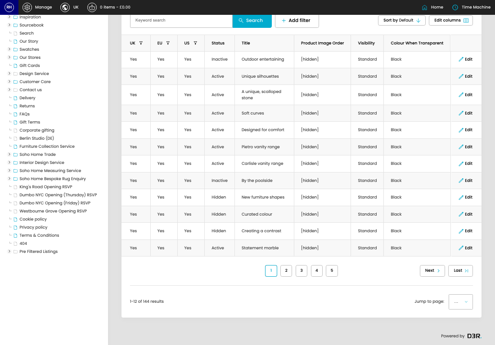

# Spaces

[Home](../../index.md) / Spaces

URL: [https://sohohome.com/cp/spaces-admin](https://sohohome.com/cp/spaces-admin)

Space

*Spaces page overview*

## Related Pages

- [Edit Space](../178-cp-spaces-admin-edit-id-c85f7117/README.md): Open an existing space when you need to check the setup or make a change.

## How It Works

- The key fields are Title, Intro, Url name, Rooms, and Listing Image, which explain what the record is for and how it can be used.

## Using This Page

1. Search or filter until you find the space you need.

## What You Can Do

### Review spaces

Search or filter the visible fields to find the space you need.

- Visible fields include UK, EU, US, Status, Title, Product Image Order, Visibility, and Colour When Transparent.

Example rows:

| UK | EU | US | Status | Title | Product Image Order |
| --- | --- | --- | --- | --- | --- |
| Yes | Yes | Yes | Inactive | Outdoor entertaining | [hidden] |
| Yes | Yes | Yes | Active | Unique silhouettes | [hidden] |
| Yes | Yes | Yes | Active | A unique, scalloped stone | [hidden] |
