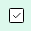

# Sticky Popups

[Home](../../index.md) / Sticky Popups

URL: [https://sohohome.com/cp/sticky-popups-admin](https://sohohome.com/cp/sticky-popups-admin)

Provider for "frame".

*Sticky Popups page overview*

## Related Pages

- [Edit Sticky Popup](../180-cp-sticky-popups-admin-edit-6-d0777fda/README.md): Open an existing sticky popup when you need to check the setup or make a change.

## How It Works

- The key fields are Title, Persona, Status, Message, and Button, which explain what the record is for and how it can be used.

## Using This Page

1. Open Sticky Popups from the CP navigation.
2. Scan the fields in the table to find the sticky popup you need.

## What You Can Do

### Review sticky popups

Review the visible fields to check what already exists.

- Field: Scheduled Start
- Field: Scheduled End
- Field: UK
- Field: EU
- Field: US
- Field: Title
- Field: Persona
- Field: Status
- Field: Trigger Height
- Field: Delay (seconds)
- Field: Colour
- Field: Created

### Update settings

Use the fields on this screen to make the change, then save once the values are correct.

## Key Settings

The sections below highlight the settings people are most likely to change.

### listing-stickypopup-form

#### Settings UK

*Settings UK setting*

Set the Settings UK value for each relevant row in this section.

#### Settings EU

*Settings EU setting*

Set the Settings EU value for each relevant row in this section.

#### Settings US

*Settings US setting*

Set the Settings US value for each relevant row in this section.
