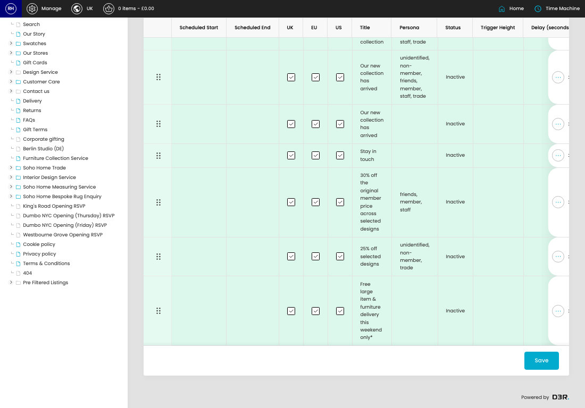

# Sticky Popups

[Home](../../index.md) / Sticky Popups

URL: [https://sohohome.com/cp/sticky-popups-admin](https://sohohome.com/cp/sticky-popups-admin)

Sticky Popups lets admins find and review existing sticky popups.

*Sticky Popups page overview*

## Related Pages

- [Edit Sticky Popup](../180-cp-sticky-popups-admin-edit-id-d0777fda/README.md): Open an existing sticky popup when you need to check the setup or make a change.

## How It Works

- The key fields are Title, Persona, Status, Message, and Button, which explain what the record is for and how it can be used.

## Using This Page

1. Scan the fields in the table to find the sticky popup you need.

## What You Can Do

### Review sticky popups

Review the visible fields to check what already exists.

- Visible fields include Scheduled Start, Scheduled End, UK, EU, US, Title, Persona, and Status.

### Update settings

Use the fields on this screen to make the change, then save once the values are correct.
