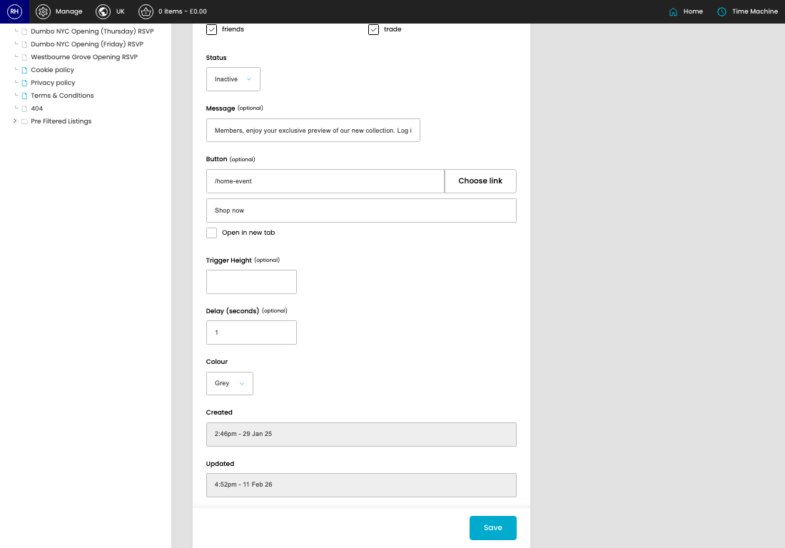
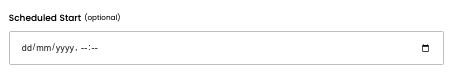
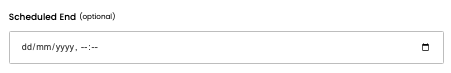
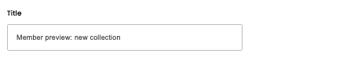

# Sticky Popups

[Home](../../index.md) / [Sticky Popups](../179-cp-sticky-popups-admin-b2e12f3e/README.md) / Edit Sticky Popup

URL: [https://sohohome.com/cp/sticky-popups-admin/edit/:id](https://sohohome.com/cp/sticky-popups-admin/edit/:id)

Use this screen when you need to check or change an existing sticky popup.

*Sticky Popups page overview*

## Related Pages

- [Sticky Popups](../179-cp-sticky-popups-admin-b2e12f3e/README.md): Review the visible fields to check what already exists.

## How It Works

- The key fields are Title, Persona, Status, Message, and Button, which explain what the record is for and how it can be used.

## Using This Page

1. Open the existing sticky popup you need to change.
2. Work through the fields that are relevant to the change.
3. Save once the details are correct.

## What You Can Do

### Edit an existing sticky popup

Open an existing sticky popup when you need to check the setup or make a change.

- Save once the details are correct.

## Key Settings

### Edit Sticky Popup

#### Scheduled Start (optional)

*Scheduled Start (optional) setting*

Add the scheduled start (optional).

**Notes:** optional

#### Scheduled End (optional)

*Scheduled End (optional) setting*

Add the scheduled end (optional).

**Notes:** optional

#### UK

Turn this on when UK should apply. Leave it off when it should not.

#### EU

Turn this on when EU should apply. Leave it off when it should not.

#### US

Turn this on when US should apply. Leave it off when it should not.

#### Title

*Title setting*

Add the title.

**Validation:** Required.

#### unidentified

Turn this on when unidentified should apply. Leave it off when it should not.

#### non-member

Turn this on when non-member should apply. Leave it off when it should not.

#### friends

Turn this on when friends should apply. Leave it off when it should not.

#### member

Turn this on when member should apply. Leave it off when it should not.

#### staff

Turn this on when staff should apply. Leave it off when it should not.

#### trade

Turn this on when trade should apply. Leave it off when it should not.

#### Status

Choose the option that matches this status.

**Options:** Inactive, Active

#### Message (optional)

Add the message (optional).

**Notes:** optional

#### Link

Use the expected format shown by the placeholder: "Link".

**Notes:** optional

#### Label

Use the expected format shown by the placeholder: "Label".

**Notes:** optional

#### Open in new tab

Turn this on when open in new tab should apply. Leave it off when it should not.

**Notes:** optional

#### Trigger Height (optional)

Add the trigger height (optional).

**Notes:** optional

#### Delay (seconds) (optional)

Add the delay (seconds) (optional).

**Notes:** optional

#### Colour

Choose the option that matches this colour.

**Options:** Grey, Black

## Page Sections

- Choose link
