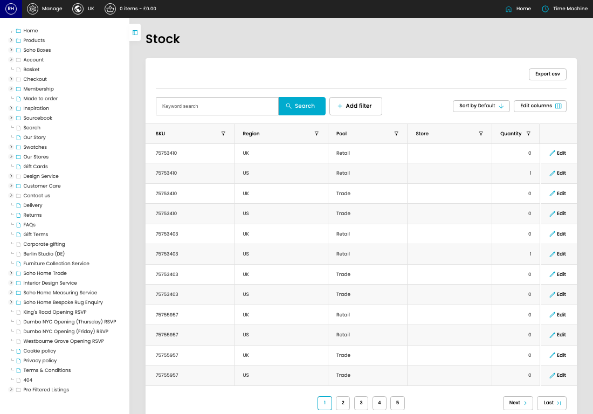

# Stock

[Home](../../index.md) / Stock

URL: [https://sohohome.com/cp/stock-admin](https://sohohome.com/cp/stock-admin)

Stock covers the admin screen used to review and maintain stock.

*Stock page overview*

## Related Pages

- [Edit Stock](../182-cp-stock-admin-edit-1-5f5372eb/README.md): Open an existing stock when you need to check the setup or make a change.

## How It Works

- After this has been updated.
- Refresh Action.
- The key fields are SKU, Region, Pool, Store, and Quantity, which explain what the record is for and how it can be used.

## Using This Page

1. Open Stock from the CP navigation.
2. Search or filter until you find the stock you need.

## What You Can Do

### Review stock

Search or filter the visible fields to find the stock you need.

- Field: SKU
- Field: Region
- Field: Pool
- Field: Store
- Field: Quantity

Example rows:

| SKU | Region | Pool | Store | Quantity |
| --- | --- | --- | --- | --- |
| 75753410 | UK | Retail |  | 0 |
| 75753410 | US | Retail |  | 1 |
| 75753410 | UK | Trade |  | 0 |
