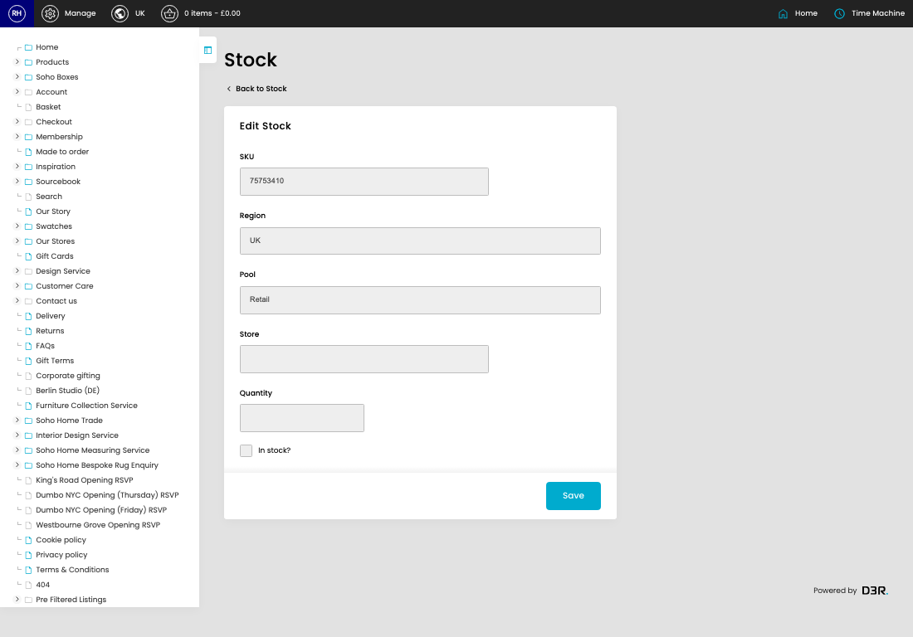
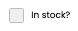

# Stock

[Home](../../index.md) / Edit Stock

URL: [https://sohohome.com/cp/stock-admin/edit/1](https://sohohome.com/cp/stock-admin/edit/1)

Stock covers the admin screen used to review and maintain stock.

*Stock page overview*

## Related Pages

- [Stock](../181-cp-stock-admin-2b032f05/README.md): Search or filter the visible fields to find the stock you need.

## How It Works

- After this has been updated.
- Refresh Action.
- The key fields are SKU, Region, Pool, Store, and Quantity, which explain what the record is for and how it can be used.

## Using This Page

1. Open the existing stock you need to change.
2. Work through the fields that are relevant to the change.
3. Save once the details are correct.

## What You Can Do

### Edit an existing stock

Open an existing stock when you need to check the setup or make a change.

- Save once the details are correct.

## Key Settings

### Edit Stock

#### In stock?

*In stock? setting*

Turn this on when in stock? should apply. Leave it off when it should not.
