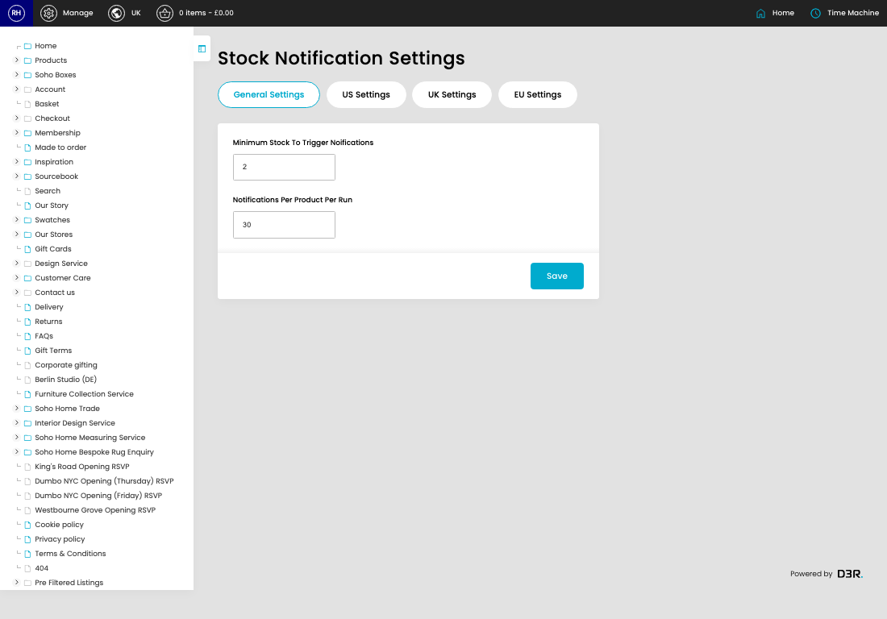
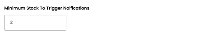
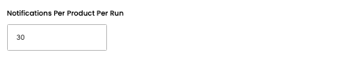

# Stock Notification Settings

[Home](../../index.md) / Stock Notification Settings

URL: [https://sohohome.com/cp/stock-notification-settings](https://sohohome.com/cp/stock-notification-settings)

Stock Notification Settings covers the admin screen used to review and maintain stock notification settings.

*Stock Notification Settings page overview*

## How It Works

- Makes sure the transfer property is set appropriately.
- The key fields are Minimum Stock To Trigger Noifications, Notifications Per Product Per Run, Status, Last Send, and Status, which explain what the record is for and how it can be used.

## Using This Page

1. Open the Stock Notification Settings screen.
2. Work through the fields that are relevant to the change, then save once the details are correct.

## What You Can Do

### Update settings

Use the fields on this screen to make the change, then save once the values are correct.

## Key Settings

### Stock Notification Settings

#### Minimum Stock To Trigger Noifications

*Minimum Stock To Trigger Noifications setting*

Add the minimum stock to trigger noifications.

**Validation:** Required.

#### Notifications Per Product Per Run

*Notifications Per Product Per Run setting*

Add the notifications per product per run.

**Validation:** Required.

## Available Actions

- General Settings
- US Settings
- UK Settings
- EU Settings
