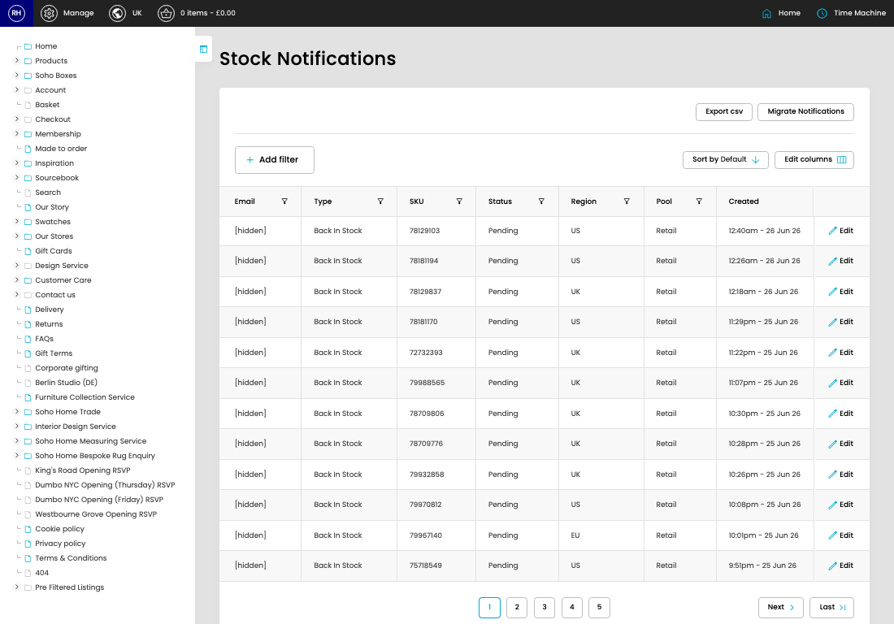

# Stock Notifications

[Home](../../index.md) / Stock Notifications

URL: [https://sohohome.com/cp/stock-notifications-admin](https://sohohome.com/cp/stock-notifications-admin)

Stock notification listing aspect.

*Stock Notifications page overview*

## Related Pages

- [Edit Stock Notification](../185-cp-stock-notifications-admin-edit-id-14aff7b9/README.md): Open an existing stock notification when you need to check the setup or make a change.

## How It Works

- Makes sure the transfer property is set appropriately.
- The key fields are ID, Email, Type, SKU, and Status, which explain what the record is for and how it can be used.

## Using This Page

1. Scan the fields in the table to find the stock notification you need.

## What You Can Do

### Review stock notifications

Review the visible fields to check what already exists.

- Visible fields include Email, Type, SKU, Status, Region, Pool, and Created.

Example rows:

| Email | Type | SKU | Status | Region | Pool |
| --- | --- | --- | --- | --- | --- |
| [hidden] | Back In Stock | 78129103 | Pending | US | Retail |
| [hidden] | Back In Stock | 78181194 | Pending | US | Retail |
| [hidden] | Back In Stock | 78129837 | Pending | UK | Retail |

## Page Sections

- Migrate Notifications
