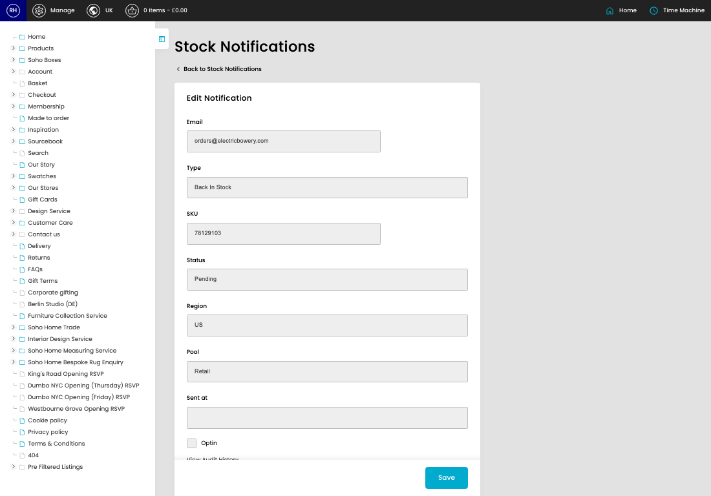

# Stock Notifications

[Home](../../index.md) / Edit Stock Notification

URL: [https://sohohome.com/cp/stock-notifications-admin/edit/248964](https://sohohome.com/cp/stock-notifications-admin/edit/248964)

Stock Notifications covers the admin screen used to review and maintain stock notifications.

*Stock Notifications page overview*

## Related Pages

- [Stock Notifications](../184-cp-stock-notifications-admin-cb118a74/README.md): Review the visible fields to check what already exists.

## How It Works

- Makes sure the transfer property is set appropriately.
- The key fields are ID, Email, Type, SKU, and Status, which explain what the record is for and how it can be used.

## Using This Page

1. Open the existing stock notification you need to change.
2. Work through the fields that are relevant to the change.
3. Save once the details are correct.

## What You Can Do

### Edit an existing stock notification

Open an existing stock notification when you need to check the setup or make a change.

- Save once the details are correct.

## Key Settings

### Edit Notification

#### Optin

*Optin setting*

Turn this on when optin should apply. Leave it off when it should not.
