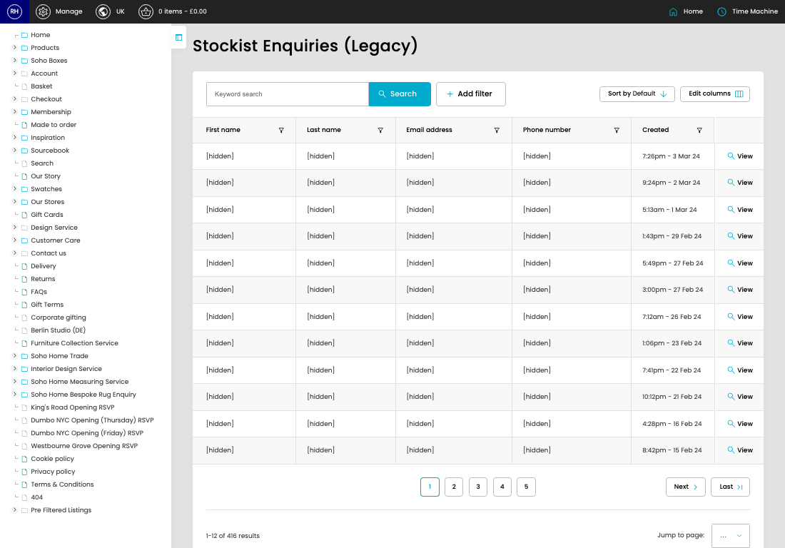

# Stockist Enquiries (Legacy)

[Home](../../index.md) / Stockist Enquiries (Legacy)

URL: [https://sohohome.com/cp/stockists-enquiry-admin](https://sohohome.com/cp/stockists-enquiry-admin)

Listing for managing stockist enquires

*Stockist Enquiries (Legacy) page overview*

## Related Pages

- [View Stockist Enquiries (Legacy)](../187-cp-stockists-enquiry-admin-view-416-8fca1c95/README.md): Open an existing stockist enquiries (legacy) when you need to check the full details.

## How It Works

- The key fields are First name, Last name, Email address, Phone number, and Message, which explain what the record is for and how it can be used.

## Using This Page

1. Open Stockist Enquiries (Legacy) from the CP navigation.
2. Search or filter until you find the stockist enquiries (legacy) you need.

## What You Can Do

### Review stockist enquiries (legacy)

Search or filter the visible fields to find the stockist enquiries (legacy) you need.

- Field: First name
- Field: Last name
- Field: Email address
- Field: Phone number
- Field: Created

Example rows:

| First name | Last name | Email address | Phone number | Created |
| --- | --- | --- | --- | --- |
| William | Hyndman | will@williamhyndman.co.nz | +61492159094 | 7:26pm - 3 Mar 24 |
| Helen | Miller | helenmiller@fenwick.co.uk | 07881553703 | 9:24pm - 2 Mar 24 |
| Lanese | Mainer | hello@houseybrand.com | +16784577567 | 5:13am - 1 Mar 24 |
