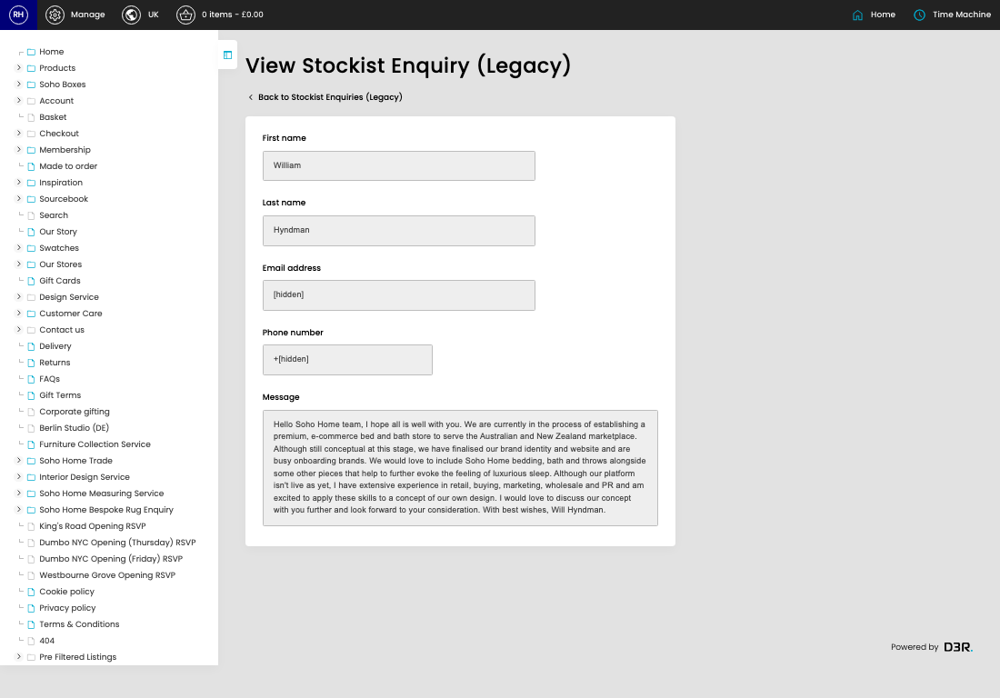

# Stockist Enquiries (Legacy)

[Home](../../index.md) / [Stockist Enquiries (Legacy)](../186-cp-stockists-enquiry-admin-cde18a80/README.md) / View Stockist Enquiries (Legacy)

URL: [https://sohohome.com/cp/stockists-enquiry-admin/view/:id](https://sohohome.com/cp/stockists-enquiry-admin/view/:id)

Listing for managing stockist enquires

*Stockist Enquiries (Legacy) page overview*

## Related Pages

- [Stockist Enquiries (Legacy)](../186-cp-stockists-enquiry-admin-cde18a80/README.md): Search or filter the visible fields to find the stockist enquiries (legacy) you need.

## How It Works

- The key fields are First name, Last name, Email address, Phone number, and Message, which explain what the record is for and how it can be used.

## Using This Page

1. Open the existing stockist enquiries (legacy) you need to review.
2. Use the visible fields to check the details.

## What You Can Do

### Review an existing stockist enquiries (legacy)

Open an existing stockist enquiries (legacy) when you need to check the full details.
