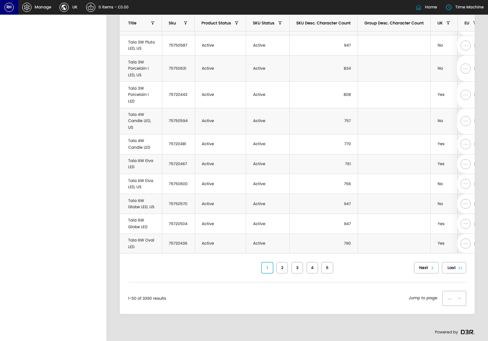

# SKUs with Issues

[Home](../../index.md) / SKUs With Issues

URL: [https://sohohome.com/cp/stockitem-issues-admin](https://sohohome.com/cp/stockitem-issues-admin)

Local implementation of stock item

*SKUs with Issues page overview*

## How It Works

- After this has been updated.
- Refresh Action.
- The key fields are Item Category, Main Category, URL, Is new?, and Season, which explain what the record is for and how it can be used.

## Using This Page

1. Scan the fields in the table to find the skus with issue you need.

## What You Can Do

### Review skus with issues

Review the visible fields to check what already exists.

- Visible fields include Title, Sku, Product Status, SKU Status, SKU Desc. Character Count, Group Desc. Character Count, UK, and EU.

Example rows:

| Title | Sku | Product Status | SKU Status | SKU Desc. Character Count | Group Desc. Character Count |
| --- | --- | --- | --- | --- | --- |
| Meard Leather Magazine Holder | 75716453 | Active | Inactive | 534 |  |
| Bassett Bergamot & Mandarin Zest Candle, Large 600g | 74508962 | Active | Inactive | 424 |  |
| Bassett Leather & Oud Candle, Large 600g | 74508948 | Active | Inactive | 399 |  |

## Page Sections

- Content
- Locale
- Pricing
- Product
- Supplier
- Duplicate Component Links
