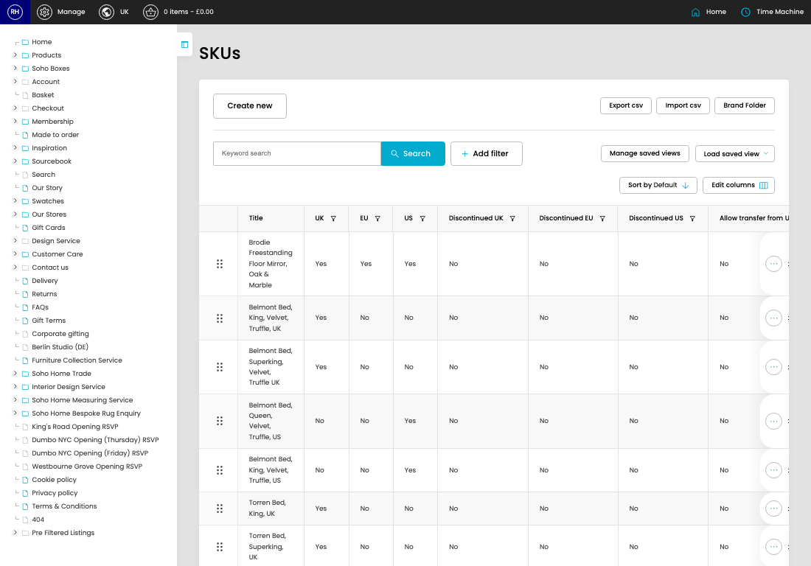

# SKUs

[Home](../../index.md) / SKUs

URL: [https://sohohome.com/cp/stockitems-admin](https://sohohome.com/cp/stockitems-admin)

Admin listing with visual merchandising added on

*SKUs page overview*

## How It Works

- After this has been updated.
- The key fields are Item Category, Main Category, URL, Is new?, and Season, which explain what the record is for and how it can be used.

## Using This Page

1. Open SKUs from the CP navigation.
2. Search or filter until you find the SKU you need.

## What You Can Do

### Review skus

Search or filter the visible fields to find the SKU you need.

- Field: Title
- Field: UK
- Field: EU
- Field: US
- Field: Discontinued UK
- Field: Discontinued EU
- Field: Discontinued US
- Field: Allow transfer from UK to EU
- Field: Status
- Field: UK Default?
- Field: EU Default?
- Field: US Default?

Example rows:

| Title | UK | EU | US | Discontinued UK | Discontinued EU |
| --- | --- | --- | --- | --- | --- |
|  | Brodie Freestanding Floor Mirror, Oak & Marble | Yes | Yes | Yes | No |
|  | Belmont Bed, King, Velvet, Truffle, UK | Yes | No | No | No |
|  | Belmont Bed, Superking, Velvet, Truffle UK | Yes | No | No | No |

## Key Settings

The sections below highlight the settings people are most likely to change.

### SKUs

#### select

*select setting*

Choose the option that matches this select.

**Options:** Load saved view, Sale Items

## Available Actions

- Import csv
- Brand Folder
- Manage saved views
