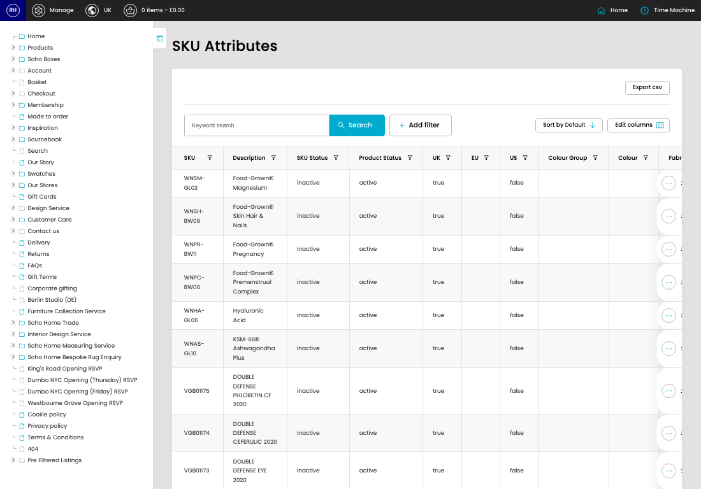

# SKU Attributes

[Home](../../index.md) / SKU Attributes

URL: [https://sohohome.com/cp/stockitems-attributes-admin](https://sohohome.com/cp/stockitems-attributes-admin)

SKU Attributes lets admins find and review existing SKU attributes.

*SKU Attributes page overview*

## Related Pages

- [Edit SKU Attribute](../192-cp-stockitems-attributes-admin-edit-id-550bb43a/README.md): Open an existing SKU attribute when you need to check the setup or make a change.

## How It Works

- The key fields are SKU, Description, SKU Status, Product Status, and UK, which explain what the record is for and how it can be used.

## Using This Page

1. Search or filter until you find the SKU attribute you need.

## What You Can Do

### Review SKU attributes

Search or filter the visible fields to find the SKU attribute you need.

- Visible fields include SKU, Description, SKU Status, Product Status, UK, EU, US, and Colour Group.

Example rows:

| SKU | Description | SKU Status | Product Status | UK | EU |
| --- | --- | --- | --- | --- | --- |
| WNSM-GL02 | Food-Grown® Magnesium | inactive | active | true |  |
| WNSH-BW09 | Food-Grown® Skin Hair & Nails | inactive | active | true |  |
| WNPR-BW11 | Food-Grown® Pregnancy | inactive | active | true |  |
